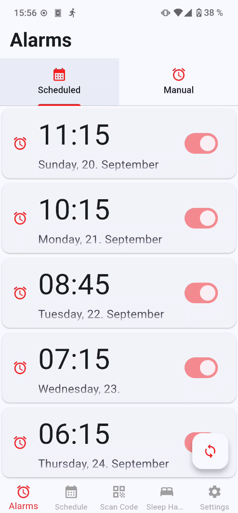

# wakeywakey

[](https://github.com/Dam0k1es/wakeywakey/actions/workflows/ci.yml)
[](LICENSE)

Welcome to Wakey Wakey, an innovative alarm clock app designed for individuals with irregular sleep patterns. Whether you work shifts, travel frequently, or simply have trouble waking up, Wakey Wakey has features tailored to your needs.

<p align="center">
  
</p>

## Features

- **Calendar Integration:** Syncs with your mobile calendar to derive intelligent alarm schedules based on your commitments.
- **Gentle Wake-Up:** Alarm volume increases gradually for a smoother start to your day.
- **Guaranteed Wake-Up:** Requires scanning a physical QR code to turn off the alarm, ensuring you get out of bed. "Guaranteed" isn't absolute: a couple of narrow fail-safes exist so a broken camera can't lock you in with a ringing alarm forever - see `docs/REQUIREMENTS.md` R4 for exactly what they are and why they're there.

## Technologies Used

- **Flutter:** For cross-platform development.

## Supported Platforms

- **Android** is the actual target platform. `minSdk` 24 (Android 7.0), `targetSdk` 36 (Android 16).
- **iOS** has project scaffolding but has never actually been built or run - treat it as
  unverified, not supported, until someone with a Mac/Xcode does that work.

## Installation Instructions

### Prerequisites

Ensure you have the following installed:

- [Flutter](https://flutter.dev/docs/get-started/install)
- [Dart](https://dart.dev/get-dart)

### Steps

1. **Clone the Repository**
   ```sh
   git clone https://github.com/Dam0k1es/wakeywakey.git
   cd wakeywakey
   ```

2. *Install Dependencies*
   ```sh
   flutter pub get
   ```

3. *Run the app for local development* (hot reload, attaches to a connected
   device or emulator)
   ```sh
   flutter run
   ```

### Installing onto a device via adb

To flash a build without a full dev loop (e.g. a signed release APK, or the
latest `dev` build for testing):

```sh
flutter build apk --release   # or --debug for a local, unsigned build
adb install -r build/app/outputs/flutter-apk/app-release.apk
```

`-r` reinstalls over an existing install (keeps app data); drop it for a
clean install. A real production build additionally needs
`android/key.properties` pointing at a signing key - see `CLAUDE.md`'s
"Current APK" section for how release builds are normally produced and
verified (`apksigner verify`) instead.

### Usage

- Open Wakey Wakey on your mobile device.
- Allow the app to sync with your calendar.
- Set up your alarm preferences
- Optionally add QR codes in remote locations.
- Enjoy a more reliable and interactive waking experience.

### Alarm scheduling

Wake-up times are derived from the calendar by a purpose-built engine, specified up front in
[`docs/scheduling-v2-spec.md`](docs/scheduling-v2-spec.md) as 18 functional requirements and then
implemented test-first against it. In short: the earliest non-all-day appointment of a day sets an
upper bound ("be up by then"), days without appointments drift gradually towards a preferred
wake-up time instead of jumping, and a wake-up time that has to move a long way is spread evenly
over the days leading up to it rather than dumped on one night. Re-planning happens at events that
are scheduled anyway - when an alarm rings, at the bedtime reminder, when the app is opened, and
when a relevant setting changes - so there is no battery-draining background worker.

### Quality & Testing

Every change is automatically checked (static analysis, dependency/secret scanning) and tested,
including end-to-end tests on a real Android emulator that must pass before a signed release build
is produced. The unit tests run six times per push, once per timezone, because the dominant bug
class in the scheduling engine is only visible away from UTC. See [`CLAUDE.md`](CLAUDE.md) for
exactly which checks run where, how to run them locally, and the current, honest testing status - and [`docs/TODO.md`](docs/TODO.md) for the known
gaps in that coverage.

### Project Documentation

See `docs/` for personas, use cases and technology choices, plus the two documents that matter
most:

- [`docs/REQUIREMENTS.md`](docs/REQUIREMENTS.md) - the essential requirements that must be met (or
  have their current status honestly stated) before any push to `master`.
- [`docs/TODO.md`](docs/TODO.md) - every known open task, prioritised, with evidence and an
  acceptance criterion.

### Contributing

Contributions are welcome! Please fork this repository and submit pull requests. For major changes, please open an issue first to discuss what you would like to change.

### License

Copyright (C) 2026 Dam0k1es, centron5961. Licensed under the GNU General Public License v3.0 - see
the [LICENSE](LICENSE) file for the full text.

---

If you find this project useful, [buymeacoffee.com/dam0k1es](https://buymeacoffee.com/dam0k1es).
