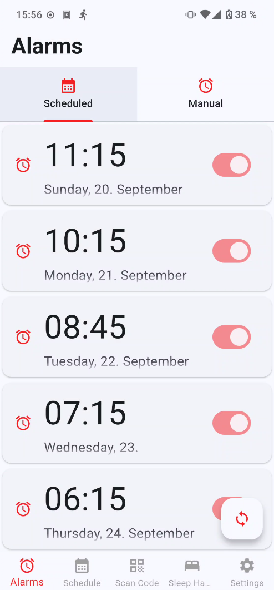

# Crescendo Alarm

[](https://github.com/Dam0k1es/crescendo-alarm/actions/workflows/ci.yml)
[](LICENSE)

Welcome to Crescendo Alarm, an innovative alarm clock app designed for individuals with irregular sleep patterns. Whether you work shifts or simply have trouble waking up, Crescendo Alarm has features tailored to your needs. (Travelling across time zones is not yet reliably supported - see [docs/timezone-requirements.md](docs/timezone-requirements.md).)

<p align="center">
  
</p>

## Features

- **Calendar Integration:** Syncs with your mobile calendar to derive intelligent alarm schedules based on your commitments.
- **Gentle Wake-Up:** Alarm volume increases gradually for a smoother start to your day.
- **Guaranteed Wake-Up:** Requires scanning a physical QR code to turn off the alarm, ensuring you get out of bed. "Guaranteed" isn't absolute: a couple of narrow fail-safes exist so a broken camera can't lock you in with a ringing alarm forever - see `docs/REQUIREMENTS.md` R4 for exactly what they are and why they're there.
- **Also:** manual alarms (repeat days, per-alarm tone/volume/snooze/code settings), snooze within
  a wake-up budget, a bedtime reminder, an optional sleep-time Do Not Disturb, imported custom
  alarm tones, choosing which calendars count and ignoring single events, sharing/printing the
  deactivation code, and an opt-in, PII-free diagnostics log - see the [User Guide](docs/USER_GUIDE.md).

## Technologies Used

- **Flutter:** For cross-platform development.

## Supported Platforms

- **Android** is the actual target platform. `minSdk` 24 (Android 7.0), `targetSdk` 36 (Android 16).
- **iOS** has project scaffolding but has never actually been built or run - treat it as
  unverified, not supported, until someone with a Mac/Xcode does that work.

## Installation Instructions

### Prerequisites

Ensure you have the following installed:

- [Flutter](https://flutter.dev/docs/get-started/install)
- [Dart](https://dart.dev/get-dart)

### Steps

1. **Clone the Repository**
   ```sh
   git clone https://github.com/Dam0k1es/crescendo-alarm.git
   cd crescendo-alarm
   ```

2. *Install Dependencies*
   ```sh
   flutter pub get
   ```

3. *Run the app for local development* (hot reload, attaches to a connected
   device or emulator)
   ```sh
   flutter run
   ```

### Installing onto a device via adb

Signed release APKs are attached to the repository's
[GitHub Releases](https://github.com/Dam0k1es/crescendo-alarm/releases) - one asset per release,
`crescendo-alarm-vX.Y.Z.apk`:

```sh
adb install -r crescendo-alarm-vX.Y.Z.apk
```

To flash your own build without a full dev loop:

```sh
flutter build apk --debug     # build/app/outputs/flutter-apk/app-debug.apk
adb install -r build/app/outputs/flutter-apk/app-debug.apk
```

`-r` reinstalls over an existing install (keeps app data); drop it for a
clean install. Android only updates an install signed with the same key: a
debug build is signed with your machine's debug key (or the project's shared
dev key, if `android/app/keystore/crescendo-alarm-dev.jks` is present), so it
cannot update a release install in place. `flutter build apk --release`
additionally needs `android/key.properties` pointing at a signing key -
release builds are normally produced by CI (`release.yml`, see `CLAUDE.md`'s
"CI/CD pipeline").

### Usage

- Open Crescendo Alarm - the first screen is the privacy policy; nothing is requested until you
  acknowledge it.
- Open the **Schedule** tab and pick which calendars should drive your wake-up times (grants
  calendar access the first time).
- Adjust **Sleep Habits** to taste - most people only need "Preferred wake-up time" and the two
  lead-time durations. Every option has a **?** button with a short explanation.
- Optionally set up a **Scan Code** deactivation code and place it somewhere you have to get up to
  reach.
- Enjoy a more reliable and interactive waking experience.

For every screen and control in detail, see the full [User Guide](docs/USER_GUIDE.md).

### Alarm scheduling

Wake-up times are derived from the calendar by a purpose-built engine, specified up front in
[`docs/scheduling-v2-spec.md`](docs/scheduling-v2-spec.md) as numbered functional requirements (FR-1 … FR-21) and then
implemented test-first against it. In short: the earliest non-all-day appointment of a day sets an
upper bound ("be up by then"), days without appointments drift gradually towards a preferred
wake-up time instead of jumping, and a wake-up time that has to move a long way is spread evenly
over the days leading up to it rather than dumped on one night. Re-planning happens at events that
occur anyway - when an alarm rings, when the app is opened (at most once a day), when a relevant
setting changes, and on the alarm list's sync button - so there is no battery-draining background
worker.

### Quality & Testing

Every change is automatically checked (static analysis, dependency/secret scanning) and tested,
including end-to-end tests on a real Android emulator that must pass before a signed release build
is produced. The unit tests run ten times per push, once per timezone, because the dominant bug
class in the scheduling engine is only visible away from UTC. See [`CLAUDE.md`](CLAUDE.md) for
exactly which checks run where, how to run them locally, and the current, honest testing status - and [`docs/TODO.md`](docs/TODO.md) for the known
gaps in that coverage.

### Project Documentation

See `docs/` for personas, use cases and technology choices, plus the documents that matter
most:

- [`docs/REQUIREMENTS.md`](docs/REQUIREMENTS.md) - the essential requirements that must be met (or
  have their current status honestly stated) before any push to `master`.
- [`docs/TODO.md`](docs/TODO.md) - every known open task, prioritised, with evidence and an
  acceptance criterion.
- [`docs/USER_GUIDE.md`](docs/USER_GUIDE.md) - every screen and control the app exposes, for
  end users rather than contributors.

### Contributing

Contributions are welcome! Please fork this repository and submit pull requests. For major changes, please open an issue first to discuss what you would like to change.

### License

Copyright (C) 2026 Dam0k1es, centron5961. Licensed under the GNU General Public License v3.0 - see
the [LICENSE](LICENSE) file for the full text.

---

If you find this project useful, [buymeacoffee.com/dam0k1es](https://buymeacoffee.com/dam0k1es).
