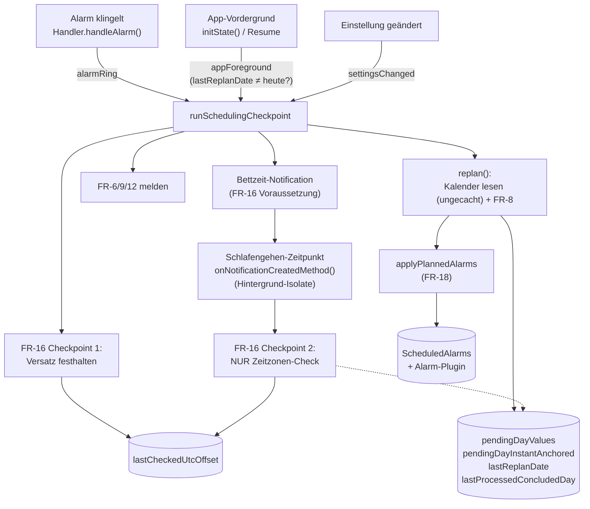

# Scheduling-Logik v2: Anforderungen, Architektur, Implementierung

> Status: entworfen, mehrfach simuliert und gegen den tatsächlichen Code/echte Abhängigkeiten
> (Android, Flutter, `device_calendar`, `awesome_notifications`, `alarm`, `timezone`) auf
> Realisierbarkeit geprüft. **Phase 0–5 implementiert und anschließend konsolidiert (2026-09).**
> 18 funktionale Anforderungen (FR-1–18), jede mit exakter Formel/exaktem Verfahren und mindestens
> einem durchgerechneten Testfall. Ersetzt `lib/models/scheduling/scheduling.dart`s
> `getEarliestEvent`/`adjustAlarmTimes`/`getStartTimeForDate` vollständig, nicht nur punktuell.
> Passend zum projektweiten TDD-Grundsatz (`CLAUDE.md`, "Development process") existiert pro FR
> mindestens ein `test()`-Block, geschrieben vor der jeweiligen Regel.
>
> **Was der TDD-Zyklus selbst zutage gebracht hat** (die FR-Texte unten sind entsprechend
> korrigiert, siehe FR-4, FR-5, FR-6, FR-7, FR-9): mehrere reale Logikfehler, die eine rein
> textliche Spec-Prüfung nicht gefunden hatte. Phase 4 brachte zwei in Phase 0 übersehene
> FR-3-Felder nach (`wunschzeit`, `maxDailyDelta`; `lastEffectiveWakeTime` bleibt bewusst kein
> eigenes Feld, sondern wird aus `pendingDayValues` abgeleitet).
>
> **Konsolidierungsdurchgang 2026-09-10** (Befunde aus einer Konsistenzprüfung des gesamten
> Umbaus, `docs/TODO.md` T-75 bis T-88; alle im Code behoben):
>
> - **T-61 ist geschlossen.** Die frühere Einschätzung "Kern behoben" war falsch gewesen -
>   `hardFloor` gab `Meeting.from` als `TZDateTime` in der *Termin-eigenen* Zone weiter, während
>   jeder andere Wert UTC-getaggt ist und `_wallClockDelta` Ziffernfelder vergleicht. Normalisiert
>   an vier Frame-Grenzen; die Annahme "gilt nur für Geräte in UTC+0" gilt **nicht** mehr. Damit
>   das nicht zurückfällt, tragen die beiden erlaubten Lesarten eines gespeicherten Werts jetzt
>   Namen (`lib/models/scheduling/stored_values.dart`, T-83).
> - **T-76:** die Tagesarithmetik läuft vollständig über Kalenderfelder
>   (`lib/models/scheduling/day_marker.dart`), nicht über absolute Dauern - sonst zählte
>   `computeWeekPlan` über eine Sommerzeit-Umstellung einen Fenstertag zu wenig.
> - **T-75:** FR-17s Tagessperre und der Fortschritt der Tagesfortschreibung sind getrennte Felder
>   (`lastReplanDate` bzw. `lastProcessedConcludedDay`) - vorher verbrauchte ein
>   Erholungs-Replan den Marker, ohne fortzuschreiben, und der Tag war für FR-9/FR-12 verloren.
> - **T-77/T-80/T-87:** es gibt genau **einen** Einstiegspunkt,
>   `runSchedulingCheckpoint({trigger})` (`lib/models/scheduling/checkpoint.dart`). Er ist gegen
>   sich selbst serialisiert (vorher konnten Ring- und Resume-Auslöser verschränkt laufen) und
>   führt die Sequenz vollständig aus, inklusive der Bettzeit-Notification.
> - **T-78:** FR-9s Sicherheitsventil greift nicht bei gesetzter `wunschzeit` (siehe FR-9) - vorher
>   war es für solche Nutzer eine Einbahnstraße in einen dauerhaft toten Wecker.
> - **T-79/T-81/T-82/T-84/T-88:** Plugin-Initialisierung wird abgewartet, FR-9 meldet einmal pro
>   Episode, `pendingDayValues` ist nach unten begrenzt, und Ton/Lautstärke/Gentle-Wake gehören zum
>   FR-18-Abgleich (vorher klangen alle geplanten Alarme mit dem Default 0.6).
>
> **Noch offen:** `docs/TODO.md` T-62 (die tatsächliche Auslösung von
> `onNotificationCreatedMethod` durch eine stille Notification ist noch nicht auf einem echten oder
> emulierten Gerät bestätigt - laut Spec "empfohlen", kein TDD-Blocker) und Phase 6 (Ablösung des
> alten `Scheduler`, `docs/TODO.md` T-64/T-86).

## Geltungsbereich

Betrifft ausschließlich kalenderabgeleitete Alarme (`ScheduledAlarm`). `ManualAlarm`s sind
komplett ausgenommen: Sie werden von dieser Logik weder gelesen noch geschrieben, noch beeinflusst
sie deren Zustand (**FR-15**).

## Grundbegriffe

**Zeitwerte** werden durchgehend als absolute Zeitpunkte behandelt (Datum + Uhrzeit als konkreter
Instant, z. B. UTC-basiert), nie als bloße Uhrzeit-Ziffern ohne Datumsbezug (**FR-1**). Ohne diese
Festlegung sind "früher"/"später" und Zeitdifferenzen für jeden Tagesübergang über Mitternacht sowie
für jeden Zeitzonenwechsel nicht definiert. FR-1 legt nur die Arithmetik fest; wann ein
Zeitzonenwechsel selbst erkannt wird und wie wall-clock-verankerte Werte dabei behandelt werden,
regelt FR-16.

---

## FR-1 — Absolute Zeitpunkte, keine Uhrzeit-Ziffern

Jeder verwendete Zeitwert (`hardFloor`, `lastEffectiveWakeTime`, Segment-Anker, Zwischenwerte) ist
ein absoluter Zeitpunkt (Datum+Uhrzeit, intern z. B. über eine UTC-Repräsentation vergleichbar).
"Früher"/"später" und `ΔT` (Zeitdifferenz) werden ausschließlich über die absolute Differenz
zweier solcher Zeitpunkte berechnet.

- **Test:** Anker 22:00, `hardFloor` am Folgetag 05:00 → `ΔT = 7h, Richtung "später"`, nicht
  `ΔT = 17h, Richtung "früher"` (reiner Ziffernvergleich ohne Tageswechsel).
- **Test:** Anker 07:00 vor einem Zeitzonenwechsel (MEZ), `hardFloor` danach 07:00 in neuer Zone
  (JST, +8h Versatz) → `ΔT = 8h` (Instants unterscheiden sich um 8h), nicht `ΔT = 0`.

## FR-2 — `hardFloor(Tag)`: Definition und Bedeutung als Obergrenze

Nur definiert für Tage mit mindestens einem echten, **nicht-ganztägigen** Kalendertermin. Ein Tag
mit ausschließlich ganztägigen Terminen (`isAllDay=true`) oder ganz ohne Termin ist ein
**Lückentag** ohne `hardFloor`.

```
hardFloor(Tag) = frühester nicht-ganztägiger Termin an diesem Tag
                 − durationToWakeUp − durationToGetReady
```

`hardFloor` ist eine **Obergrenze** ("nicht später als"). Der geplante Wert darf früher liegen
(immer erlaubt), aber **niemals später** (ein späterer Wert bedeutet, einen echten Termin zu
verpassen).

**Termin-eigene Zeitzone:** Die **eigene Zone eines Termins** bestimmt ausschließlich die
Umrechnung seines Beginns in einen absoluten Instant (bereits vorhandene Funktionalität,
`convertToTZDateTime` in `lib/utils/utils.dart`). Die **Geräte-Zeitzone zum Auswertungszeitpunkt**
(derselbe Versatz, den FR-16 prüft) - **niemals** die Zone des Termins selbst - entscheidet, welchem
Kalendertag der Instant zugeordnet wird. Begründung: wer geweckt werden muss, ist physisch dort, wo
das Gerät ist, nicht dort, wo der Termin verortet ist.

**Testbarkeit:** die reine Funktion (`eventsForDay`) nimmt den Geräte-Versatz als **expliziten
Parameter** entgegen, statt intern `DateTime.toLocal()` aufzurufen - Letzteres hinge an der
Systemzeitzone der ausführenden Maschine und wäre damit nicht deterministisch testbar. Nur die
dünne AppState-Schicht (Architektur) liest den tatsächlichen, aktuellen Versatz (`DateTime.now()
.timeZoneOffset`) und reicht ihn als Wert weiter.

- **Test:** Zwei nicht-ganztägige Termine (09:00, 07:00), `durationToWakeUp=15min`,
  `durationToGetReady=15min` → `hardFloor` = 07:00 − 30min = **06:30** (der frühere zählt).
- **Test:** Ein ganztägiger + ein nicht-ganztägiger Termin (08:00), gleiche Offsets → `hardFloor` =
  08:00 − 30min = **07:30** (der ganztägige fließt nie ein).
- **Test:** Nur ein ganztägiger Termin → kein `hardFloor`, Lückentag.
- **Test (Termin-eigene Zeitzone):** Tom (Gerät in `Europe/Berlin`) hat einen Termin mit
  `startTimeZone=Asia/Tokyo`, Beginn 03:00 JST = 19:00 CET **am Vortag** → zählt für `hardFloor` zum
  Berlin-Vortag, nicht zum Tokyo-Datum.

## FR-3 — Zustand

| Feld | Typ | Bemerkung |
|---|---|---|
| `maxDailyDelta` | `Duration` | `> 0`; System-Minimum **15 Minuten** wird erzwungen (bei 0 hätte der Parameter für `hardFloor`-Segmente keine Wirkung mehr - er würde nur dort greifen, wo er am wenigsten gebraucht wird) |
| `wunschzeit` | `TimeOfDay?` | reine Uhrzeit, **kein** Instant, **kein** Datum/Zone - wird erst am Verwendungsort (FR-4/FR-16) mit Tag+aktueller Zone kombiniert; deshalb "überträgt" FR-16 bei Zeitzonenwechsel nichts an `wunschzeit` selbst |
| `lastCheckedUtcOffset` | `Duration` | Versatz beim letzten FR-16-Checkpoint |
| `gapDayCounter` | `int` | rollierender Sicherheitsventil-Zähler (FR-9) |
| `lastReplanDate` | `Date?` | **nur** FR-17s Tagessperre: "lief heute schon ein Checkpoint?". Von FR-16 Checkpoint 2 **nicht** aktualisiert |
| `lastProcessedConcludedDay` | `Date?` | Fortschritt der Tagesfortschreibung: bis zu welchem *abgeschlossenen* Tag haben FR-9 und FR-12 gezählt bzw. geprüft? Getrennt von `lastReplanDate` (`docs/TODO.md` T-75), weil beide Bedeutungen auseinanderfallen, sobald ein Checkpoint läuft, für den heute noch nicht abgeschlossen ist |
| `pendingDayValues` | `Map<Datum, Instant?>` | die geplanten Werte selbst; `null` = kein Alarm für diesen Tag (Lückentag ohne `wunschzeit`, oder FR-9s Ventil). Revidierbar für jeden noch nicht ausgelösten Tag (FR-11), danach für immer fix. Nach unten begrenzt auf "ab vorgestern" (T-82) |
| `pendingDayInstantAnchored` | `Map<Datum, bool>` | pro geplanten Tag: kam der Wert direkt aus einem echten `hardFloor` (instant-verankert) oder aus `wunschzeit`/der Kurve (wall-clock-verankert)? FR-16 Checkpoint 2 hat keinen Kalenderzugriff und kann das nicht neu ableiten |
| `disabledDays` | `Set<Datum>` | FR-21: Tage, fuer die der Nutzer den geplanten Wecker ausdruecklich **abgeschaltet** hat. Getrennt von `pendingDayValues`, weil `null` dort "nichts geplant" heisst (FR-9/FR-10) und von der naechsten Planung ueberschrieben wuerde - das Veto des Nutzers darf das nicht |
| `snoozeEnabled` | `bool` | FR-20: darf der Nutzer den Wecker verschieben? Standard **false** |
| `snoozeTime` | `Duration` | FR-20: um wie viel ein Druck auf Snooze verschiebt. Standard **5 Minuten** |
| `snoozeOriginOf` | `Map<int, Instant>` | FR-20: je klingelndem Alarm der **ursprüngliche** Weckzeitpunkt. Trägt das Restbudget über App-Neustarts und über mehrere Snooze-Vorgänge hinweg - ohne ihn wäre nach einem Prozesstod wieder das volle Budget da |
| `overrunNotificationSent` | `bool` | FR-6 fordert "einmalig" - Merker für die laufende Overrun-Episode |
| `safetyValveNotificationSent` | `bool` | dasselbe für FR-9 (`docs/TODO.md` T-81) |

Bezieht sich ausschließlich auf die `ScheduledAlarm`-Kette.

`lastEffectiveWakeTime` ist bewusst **kein** eigenes Feld: es ist immer der Eintrag in
`pendingDayValues` für den zuletzt abgeschlossenen Tag und würde als zweite Quelle nur
auseinanderlaufen können.

## FR-4 — Tage ohne jede Notwendigkeit

Ein Tag ohne eigenen `hardFloor`, der nicht innerhalb eines aktiven Glättungs-Segments liegt (FR-7
legt fest, wann ein Segment beginnt):

- Ohne `wunschzeit`: Wert hält bei `lastEffectiveWakeTime`s Uhrzeit, aber auf dem **echten,
  tatsächlich geplanten Kalendertag** (`lastEffectiveWakeTime`s Datum + 1), nicht auf
  `lastEffectiveWakeTime`s eigenem Datum - sonst trägt der gespeicherte Wert das Datum von gestern,
  obwohl er für heute gilt (in der Implementierung beim TDD-Zyklus selbst als echter Bug gefunden:
  eine erste Fassung ließ das Datum unverändert).
- Mit `wunschzeit`: Wert driftet Richtung `wunschzeit` (kombiniert mit dem oben genannten
  tatsächlichen Kalendertag, nicht mit `lastEffectiveWakeTime`s eigenem - `wunschzeit` selbst trägt
  ohnehin kein Datum, FR-3), begrenzt durch `maxDailyDelta`/Tag, stoppt bei Erreichen (kein
  Überschießen) - **zusätzlich gedeckelt durch FR-7s Rückwärts-Prüfung**, sofern ein künftiger realer
  `hardFloor` im Fenster existiert: der Drift darf nie mehr Reserve verbrauchen, als für dessen
  fristgerechte Erreichung noch nötig ist. Der Abstand zu `wunschzeit` wird dabei wie in FR-6
  ausschließlich über die Uhrzeit-Komponenten verglichen (siehe FR-6s Klarstellung), nicht über die
  volle Kalenderdifferenz.

Die folgenden Tests prüfen **isoliert** die Drift-Regel selbst, ohne FR-7s Deckel (kein künftiger
`hardFloor` vorausgesetzt) - das Zusammenspiel mit dem Deckel testen bereits FR-7s eigene Testfälle.

- **Test:** `V=07:00`, `wunschzeit=null` → unverändert **07:00**.
- **Test:** `V=07:00`, `wunschzeit=09:00`, `maxDailyDelta=30min` → Distanz 2:00 > 30min → **07:30**.
- **Test:** `V=07:00`, `wunschzeit=05:00`, `maxDailyDelta=30min` → Distanz 2:00 > 30min → **06:30**.
- **Test (kein Überschießen):** `V=07:00`, `wunschzeit=07:15`, `maxDailyDelta=30min` → Distanz
  15min < 30min → **exakt 07:15**, nicht 07:30.
- **Test (Ziel erreicht):** `V=07:00`, `wunschzeit=07:00` → unverändert **07:00**.

## FR-5 — Zusammenfassung realer `hardFloor`-Punkte zu Segmenten ("Runs")

Reale `hardFloor`-Punkte im Fenster: `t1, t2, …, tn`, chronologisch. Ausgehend vom aktuellen Anker
`A` (Tag 0):

**Vorbedingung: nur ein bindender Punkt kann Ziel sein.** Als Ziel `t_m` kommt ausschließlich ein
Punkt in Frage, dessen Uhrzeit **früher** liegt als `A` (ΔT nach FR-6s Klarstellung, also rein über
die Uhrzeit-Komponenten). Ein Punkt, der gleich oder später liegt, fordert nichts: wer um 06:45
aufsteht, erfüllt einen Termin um 11:00 längst. Für einen solchen Tag gilt FR-4 (Drift zur
`wunschzeit`, begrenzt durch `maxDailyDelta`), und der `hardFloor` wirkt nur noch als **Deckel**
(FR-2s Obergrenze), nie als Zugseil.

Das folgt unmittelbar aus FR-2 („Der geplante Wert darf früher liegen - **immer erlaubt**") und aus
Schritt 1s eigenem Satz („`hardFloor` ist ausschließlich eine Obergrenze, nie eine
Richtungsvorgabe"), stand aber bis 2026-09-11 nirgends als Verfahrensregel - mit der Folge, dass
jeder Punkt zum Ziel wurde, auch ein späterer. Auf einem echten Kalender lief die Weckzeit dadurch
von 06:45 über 08:00 auf 11:00, bei `maxDailyDelta` = 30 min und `wunschzeit` = 07:00
(`docs/TODO.md` T-132).

Wichtig zur Abgrenzung: die Punkte werden dadurch **nicht** aus der Liste entfernt. Sie nehmen
weiterhin an Schritt 1s Verletzungsprüfung teil - genau davor warnt Schritt 1s Absatz über den
verworfenen „Richtungsfilter". Ausgeschlossen sind sie nur als *Ziel*.

- **Test:** `A=06:45`, `t1(Tag 1)=08:00`, `t2(Tag 2)=11:00`, `wunschzeit=07:00`,
  `maxDailyDelta=30min` → jeder Tag **07:00** (FR-4 erreicht die `wunschzeit` am ersten Tag und
  hält), **keine** Overrun-Meldung. Nicht 08:00/11:00.
- **Test:** derselbe Anker, ein einzelner Termin `05:00` in vier Tagen → Run nach früh:
  `06:18 / 05:52 / 05:26 / 05:00`, danach Drift zurück zur `wunschzeit`.

1. Bestimme den am weitesten in der Zukunft liegenden Punkt `t_m` (m ≥ 1), sodass die gleichmäßige
   Verteilung `A→t_m` (FR-6) **keinen** Zwischenpunkt `t1…t_{m-1}` über seinen eigenen `hardFloor`
   hinaus verschiebt. Ist das für den nächstmöglichen `t_m` verletzt, wird `m` verkleinert, bis
   erfüllt (schlimmstenfalls `m=1`). **Keine** zusätzliche Prüfung, ob `t1…t_m` "alle in dieselbe
   Richtung wie `A`" zeigen: eine erste Fassung enthielt einen solchen Richtungsfilter, der sich beim
   Durchrechnen eines mehrtägigen Runs als falsch erwies - sobald `A` (der *heutige*, bereits
   fortgeschrittene Wert, nicht der ursprüngliche Run-Start, siehe FR-7) an einem Zwischenpunkt
   `hardFloor` bereits vorbeigedriftet ist, kann dieser Punkt "auf der falschen Seite" von `A` liegen,
   ohne tatsächlich verletzt zu sein - ein Richtungsfilter hätte ihn dann fälschlich ausgeschlossen.
   `hardFloor` ist ausschließlich eine Obergrenze (FR-2), nie eine Richtungsvorgabe - die
   Verletzungsprüfung allein genügt.
2. Ein Punkt mit `ΔT=0` relativ zu `A` beendet den Run sofort bei sich selbst - zählt für keine
   Richtung als kompatibel, wird nie mit einem Folgepunkt zusammengefasst.
3. `A→t_m` wird nach FR-6 verteilt. `t_m`s Tag wird neuer Anker für den nächsten Run, beginnend bei
   `t_{m+1}`. Zurück zu Schritt 1.
4. Sind alle realen Punkte verarbeitet, gilt für alle Tage danach FR-4.

Dieses Verfahren (insbesondere Schritt 1) hat zwei Aufrufer: **real**, wenn ein Run tatsächlich
beginnt; und **hypothetisch**, täglich neu, aus FR-7s Rückwärts-Prüfung heraus, mit dem *heutigen*
Wert als Anker - um zu bestimmen, welches Ziel FR-7 heranziehen muss.

- **Test:** `A=08:00`, `t1(Tag2)=07:00`, `t2(Tag4)=06:00` - beide früher als `A`, Verteilung `A→t2`
  verletzt `t1` nicht → `t_m=t2`, ein Run über beide.
- **Test (Schrumpfung):** `A=09:00`, `t1(Mi)=06:00` (streng), `t2(Fr)=08:00` (lockerer) - naive
  Verteilung `A→t2` über 5 Tage ergäbe für Mittwoch ca. 08:24, verletzt `t1`s `hardFloor` (06:00) →
  `t_m` muss auf `t1` schrumpfen: erstes Segment `A→t1` allein, danach neuer Run ab `t1` Richtung
  `t2`.
- **Test (`ΔT=0`):** `A=07:00`, `t1(Di)=07:00`, `t2(Fr)=09:00` → `t1` beendet seinen eigenen Run bei
  sich selbst; `t2` beginnt komplett neuen Run mit Anker=`t1`.

## FR-6 — Verteilung innerhalb eines Runs

Für einen Run von Anker `A` (Tag 0) zu Ziel `F` (Tag `N`):

```
ΔT = |A − F|
Tag_i = A + Vorzeichen × (ΔT / N) × i,   für i = 1..N
```

Ist `ΔT/N > maxDailyDelta`: die Differenz wird **ebenfalls gleichmäßig** auf alle `N` Tage verteilt
(kein Sprung an einem Tag, **außer** bei `N=1` - dort ist ein Sprung mathematisch unvermeidbar und
**kein** Verstoß gegen diese Regel: "kein Sprung an einem Tag" begründet nur die Verteilungslogik
bei `N>1`, ist keine eigenständige Garantie). Bei jeder Überschreitung von `maxDailyDelta` (`N=1`
oder verteilt) wird der Nutzer **einmalig** benachrichtigt.

**Klarstellung `ΔT` und `Tag_i`s Datum (in der Implementierung als echter Bug gefunden, nicht schon
beim Entwurf):** `A` und `F` tragen als echte kalenderabgeleitete `hardFloor`-Punkte oft real weit
auseinanderliegende Datumswerte (`F` kann Tage nach `A` liegen). `ΔT = |A − F|` meint hier
**ausschließlich die Uhrzeit-Komponenten** von `A` und `F` (Stunde/Minute/Sekunde), **nie** deren
volle Kalenderdifferenz - eine naive `F − A`-Instant-Differenz über mehrere reale Tage hinweg würde
einen unsinnigen, von der Tagesanzahl dominierten Wert liefern statt der eigentlich gemeinten
kleinen täglichen Uhrzeit-Verschiebung. Die Mehrdeutigkeit bei der Richtungsbestimmung wird wie in
FR-1 aufgelöst (die Variante mit `|Δ| ≤ 12h` gewinnt). Symmetrisch dazu bekommt jeder `Tag_i` sein
**eigenes, echtes Kalenderdatum** `A`s Datum `+ i` - **nie** `F`s eigenes (ggf. weit entferntes)
Datum. `F`s eigenes Datum wird nirgends für die Berechnung selbst gebraucht, nur dafür, `F` an der
richtigen Stelle im Fenster zu verorten.

**Implementierungshinweis (UTC-Erhalt):** wird beim Aufbau von `Tag_i` (oder allgemein einem "gleiche
Uhrzeit, neues Datum"-Wert) versehentlich ein lokaler statt ein UTC-Konstruktor verwendet, obwohl `A`
selbst UTC-basiert war, entsteht ein reales, aber nur auf Maschinen mit von UTC abweichender
Systemzeitzone sichtbares Instant-Mismatch (in der Implementierung ebenfalls als echter Bug
gefunden) - jede solche Konstruktion muss `A`s (bzw. der jeweiligen Referenz) `isUtc`-Flag erhalten.

- **Test (früher):** `A=08:00, F=04:30, N=5, maxDailyDelta=60min` → `ΔT=3:30, ΔT/N=42min` (< 60min,
  kein Overrun) → Tag1=07:18, Tag2=06:36, Tag3=05:54, Tag4=05:12, Tag5=04:30.
- **Test (später):** `A=06:00, F=09:00, N=3, maxDailyDelta=90min` → `ΔT=3:00, ΔT/N=60min` (kein
  Overrun) → Tag1=07:00, Tag2=08:00, Tag3=09:00.
- **Test (Overrun, `N>1`):** `A=08:00, F=04:30, N=3, maxDailyDelta=60min` → `ΔT/N=70min > 60min` →
  Tag1=06:50, Tag2=05:40, Tag3=04:30, Benachrichtigung.
- **Test (Overrun, `N=1`):** `A=08:00, F=02:00, N=1, maxDailyDelta=60min` → voller 6h-Sprung,
  Benachrichtigung - **kein** Spezifikationsfehler.

## FR-7 — Wann beginnt ein Run tatsächlich? ("So spät wie nötig")

Ein Run beginnt **nicht** an einem vorab fixierten Tag, sondern wird bei **jeder** täglichen
Neuplanung frisch aus einer Rückwärts-Prüfung abgeleitet - strukturell wie FR-5s Schrumpfung, nur
gegen die verbleibende Distanz statt gegen einen Zwischenpunkt geprüft.

Sei `(F, N_F)` das Ergebnis von FR-5s Gruppierungsverfahren, **hypothetisch** angewendet mit dem
heutigen Wert `V` als Anker (`F = t_m`, `N_F` = dessen Tagesabstand) - **nicht** einfach "der
nächste reale `hardFloor`-Punkt": FR-5 kann einen weiter entfernten, strengeren Punkt wählen, wenn
ein näherer Zwischenpunkt lockerer ist. Für den heutigen Tag `i` (`i=1` am ersten Tag nach dem
Anker):

```
N_Rest = N_F − i     (Tage von morgen bis F, F eingeschlossen)
```

**Implementierungshinweis (als echter Bug gefunden, nicht schon beim Entwurf):** `N_F` ist hier
zwingend **`V`-relativ** (die echte Kalendertage-Distanz von `V` zu `F`) - dieselbe Zahl, die auch
`groupTarget`/`distribute` für ihre eigene Datumsplatzierung brauchen (FR-5/FR-6). `i` ist bei jedem
Aufruf von planGapOrRunStartDay implizit immer `1` (die Funktion entscheidet immer nur genau den
einen Tag unmittelbar nach `V`, nie einen weiter entfernten) - `N_Rest` ist also **immer** `N_F − 1`,
nicht `N_F` selbst. Eine erste Implementierung verwechselte `N_F` (V-relativ) direkt mit `N_Rest`
(ohne das `−1`) - isolierte Testfälle mit nur einem einzigen `hardFloor`-Punkt haben das nicht
aufgedeckt (kompensierender Fehler in den Testdaten selbst), erst ein voller, aus `computeWeekPlan`
mehrtägig durchgerechneter Testfall hat die Diskrepanz sichtbar gemacht.

Die Prüfung greift **einheitlich für jedes `N_Rest ≥ 1`** (`remainingPoints` enthält per Definition
nur Punkte echt vor heute liegend, also ist `N_Rest ≥ 1` immer gegeben) - **keine** gesonderte
`N_Rest ≤ 1`-Ausnahme, die direkt zu FR-4 durchreicht: eine erste Fassung enthielt eine solche
Ausnahme, die sich beim Durchrechnen eines mehrtägigen Runs als falsch erwies - sie hätte einen
bereits laufenden, weiterhin gültigen Run am vorletzten Tag fälschlich abgebrochen und auf reinen
`wunschzeit`-Drift zurückgesetzt. FR-6s eigene `N=1`-Ausnahme (Einzeltag-Sprung ist kein
Spezifikationsfehler) bleibt davon unberührt und greift ganz normal, sobald FR-6 selbst mit `N=1`
aufgerufen wird.

- Prüfe `|Wert_heute − F| / N_Rest ≤ maxDailyDelta` für den vorgesehenen Wert (Halten oder voller
  `wunschzeit`-Schritt) - auch hier gilt FR-6s Klarstellung: die Differenz ist uhrzeit-, nicht
  kalenderbasiert:
  - **Erfüllt:** heute bleibt Lückentag, FR-4 unverändert angewendet.
  - **Bereits beim Halten verletzt:** heute ist **Tag 1 des Runs** - FR-6 direkt angewendet, mit
    `N = N_F − i + 1` (nicht `N_Rest` - der reserviert bewusst einen Tag Puffer, damit ein
    einzelner `wunschzeit`-Schritt nicht unbemerkt genau die Reserve auffrisst, die der
    übernächste Tag noch braucht).
  - **Nur der volle `wunschzeit`-Schritt verletzt:** Drift wird auf das größtmögliche Maß reduziert,
    das die Bedingung noch erfüllt (im Extremfall 0).

Reicht selbst sofortiges Halten nicht (`N_Rest` bereits verletzt), beginnt der Run sofort heute,
Überschreitungsregel (FR-6) greift. Das Verfahren behandelt "`F` früher" und "`F` später" als `V`
symmetrisch - keine gesonderte Politik für eine Richtung.

- **Test (ein `hardFloor`-Punkt):** `wunschzeit=10:00`, `A=07:00` (So), `F(Sa)=05:00`,
  `maxDailyDelta=30min`.
  - Montag (`i=1, N_F=6, N_Rest=5`): Halten erfüllt `24min≤30min`. Voller Drift → `07:30` erfüllt
    `30min≤30min` (Grenze) → **Montag=07:30**.
  - Dienstag (`i=2, N_Rest=4`): Halten bei 07:30 verletzt `37,5min>30min` → **Tag 1 des Runs**,
    `N=5` (Di–Sa): **Di=07:00, Mi=06:30, Do=06:00, Fr=05:30, Sa=05:00.**
- **Test (zwei `hardFloor`-Punkte, FR-5-Ziel ≠ nächster Punkt):** `A=07:00` (So), `t1(Fr)=06:00`
  (locker), `t2(Sa)=04:00` (streng), `maxDailyDelta=30min`, keine `wunschzeit`.
  - FR-5 (hypothetisch): `t_m=t2` (Verteilung `A→t2` über 6 Tage ergibt an `t1`s Tag 04:30, nicht
    später als `t1`s 06:00) → `F=t2, N_F=6`.
  - Montag (`i=1, N_Rest=5`): Halten bei 07:00 verletzt bereits `36min>30min` (obwohl `t1` allein
    fälschlich 15min/Tag suggerieren würde) → **sofort Tag 1 des Runs**, `N=6`: **Mo=06:30,
    Di=06:00, Mi=05:30, Do=05:00, Fr=04:30, Sa=04:00.**

## FR-8 — Kein erweiterter Berechnungshorizont

Nur das sichtbare 7-Tage-Fenster, kein größerer Horizont. Neuplanung **täglich**, ausgelöst durch
das **tatsächliche Klingeln** des Alarms (`Handler.handleAlarm()`, ausgelöst über den
`Alarm.ringing`-Stream in `lib/main.dart` - feuert **immer**), **nicht** dessen Dismiss-Zeitpunkt
(`Handler.onAlarmHandled()` - feuert nur bei In-App-Dismiss, nicht beim nativen Wisch-Pfad, nicht
bei Overlay-Mount-Timeout; dort hängt die heutige v1-Neuplanung, unzuverlässig). Derselbe
Ring-Zeitpunkt bildet auch FR-16s ersten Checkpoint. Ein `hardFloor` außerhalb des Fensters wirkt
sich erst aus, sobald er durch die tägliche Verschiebung ins Fenster rutscht - auch wenn dann ggf.
nicht mehr genug Vorlauf für FR-7 besteht und FR-6 sofort greift.

## FR-9 — Sicherheitsventil (rollierender Zähler, nicht fensterbezogen)

```
Zähler(heute) = Anzahl unmittelbar aufeinanderfolgender, bereits abgeschlossener Tage
                unmittelbar vor heute ohne realen hardFloor,
                zurückgesetzt auf 0 am zuletzt abgeschlossenen Tag mit realem hardFloor.
```

Ein rein fensterbezogener Zähler würde am Tag *vor* einem echten, gerade außerhalb des Fensters
liegenden Termin fälschlich auslösen (Fenster an diesem Tag zufällig leer, obwohl ein legitimer Run
bereits laufen sollte) - deshalb persistent und rollierend, nicht als Fenster-Momentaufnahme.
Heutiger Tag zählt **nicht** mit (noch nicht abgeschlossen) - "heute" meint hier den Tag, für den
gerade das neue Fenster geplant wird (den ersten Tag *nach* dem Tag, dessen Alarm soeben geklingelt
hat); Letzterer selbst ist zu diesem Zeitpunkt bereits abgeschlossen und fließt genau einmal, in
genau diesem Checkpoint, in den Zähler ein - nicht erst später nachgetragen. Selbstheilend: kein manuell
zurückzusetzender Zustand außer der einen Zahl. Erreicht der Zähler ≥7, wird automatische
Fortschreibung gestoppt und der Nutzer benachrichtigt.

**Ausnahme: gesetzte `wunschzeit` (nachträglich ergänzt, `docs/TODO.md` T-78).** Das Ventil greift
nur, wenn *keine* `wunschzeit` gesetzt ist. Begründung: das Ventil ist eine Rückfallebene gegen
*blinde* Fortschreibung - gegen ein Weiterdriften ohne jede Orientierung. Eine gesetzte
`wunschzeit` **ist** diese Orientierung: FR-4 driftet auf sie zu und hält exakt auf ihr an, die
Fortschreibung ist also von sich aus beschränkt und kann nicht davonlaufen. Ohne diese Ausnahme
wäre das Ventil für einen Nutzer mit `wunschzeit` und ohne Kalendertermine eine Einbahnstraße in
einen dauerhaft toten Wecker: alle Fensterwerte werden `null`, FR-18 entfernt daraufhin sämtliche
Zukunftsalarme, es klingelt nichts mehr - und damit gibt es auch keinen Ring-Checkpoint mehr, über
den der Zähler je zurückgesetzt werden könnte (nur ein Tag mit realem `hardFloor` setzt ihn
zurück). Für eine App mit dem Versprechen "garantiertes Aufwachen" ist das der falsche Ausgang.

Der Zähler selbst läuft dabei unverändert weiter und zählt weiterhin termin-lose Tage ehrlich mit -
entfernt der Nutzer seine `wunschzeit` später wieder, greift das Ventil ab dem nächsten Checkpoint
sofort, ohne erst sieben Tage neu sammeln zu müssen.

- **Test:** Zähler ≥7, kein `hardFloor` im Fenster, aber `wunschzeit` gesetzt → **kein** Auslösen,
  jeder Fenstertag behält einen Wert.
- **Test:** derselbe Fall ohne `wunschzeit` → Auslösen wie bisher.

**Akzeptiertes Restrisiko:** `Alarm.ringing` liefert innerhalb einer laufenden
`_MyHomePageState`-Instanz garantiert genau ein `handleAlarm()` pro neu klingelndem Alarm (bereits
korrekt dedupliziert gegen `_previousRingingAlarms`, `lib/main.dart`). Nur falls der App-Prozess
exakt während eines aktiv klingelnden Alarms beendet und neu gestartet wird, könnte der Zähler
einmalig doppelt inkrementiert werden - akzeptiert, keine gesonderte Behandlung (das
Sicherheitsventil ist eine konservative Rückfallebene, kein korrektheitskritischer Mechanismus).

- **Test:** Termin liegt genau 8 Tage in der Zukunft (außerhalb des Fensters); die 6 Tage
  unmittelbar vor heute waren termin-los (heute zählt nicht mit) → Zähler steht bei 6, nicht 7 →
  kein Auslösen.

## FR-10 — Kaltstart

Existiert kein `lastEffectiveWakeTime` (allererste Planung), wird **kein** Wert für Tage vor dem
ersten realen `hardFloor` erfunden:

- Mit `wunschzeit`: diese Tage nutzen sie.
- Ohne: kein Alarm geplant.
- Der erste reale `hardFloor` wird an seinem eigenen Tag gesetzt (FR-2) und wird ab da Anker für
  alle Folgetage.

- **Test:** Tag1–5 termin-los, Tag6 `hardFloor=05:30`, keine `wunschzeit` → Tag1–5 kein Alarm,
  Tag6=05:30 wird neuer Anker.

## FR-11 — Revisionierbarkeit bis zum tatsächlichen Klingeln

Ein bereits berechneter, aber noch nicht ausgelöster Tageswert bleibt revisionierbar: liefert der
**nächste tatsächliche Kalender-Neuread** eine geänderte Kalenderlage, darf der Wert rückwirkend
angepasst werden (inkl. erneuter Anwendung von FR-5–FR-7). Erst der tatsächlich ausgelöste Wert ist
für immer fix.

**Keine Live-Erkennung:** `device_calendar` (`^4.3.2`) bietet keine Änderungsbenachrichtigung (kein
Stream/Callback, kein `ContentObserver`, weder Dart- noch nativ-seitig) - die tatsächlichen
Neuread-Zeitpunkte sind FR-8s Ring-Checkpoint und FR-17s App-Vordergrund-Checkpoint, je nachdem was
zuerst eintritt. Ein Live-Mechanismus wäre technisch baubar (Android `JobInfo.addTriggerContentUri`),
aber unverhältnismäßig für eine private Wecker-App und würde ohnehin vom OS gebündelt/verzögert
ausgeliefert.

**Ungecachter Zugriff Pflicht:** Der Neuread muss den Kalender **frisch** abfragen - die bestehende
`updateCalendarData`/`_fetchedCalendarWeeks`-Zwischenspeicherung (`lib/app_state.dart`) markiert
Wochen dauerhaft als "geladen", auch wenn nie erneut abgefragt (`docs/TODO.md` T-60 - bereits ein
Bug im Bestandscode, unabhängig von v2). Die neue Planung darf diesen Cache **nicht**
wiederverwenden, sonst bleibt eine Kalenderänderung für die gesamte Prozesslaufzeit unsichtbar.

## FR-12 — Verspätet bekannte Termine nach dem Klingeln

Wird beim **nächsten tatsächlichen Kalender-Neuread** (FR-8 oder FR-17, je nachdem was zuerst
eintritt) nach dem Klingeln eines Tages (per FR-11 nicht mehr revisionierbar) durch verspätet
eingetroffene Kalenderdaten ein realer Termin bekannt, dessen `hardFloor` vor dem Klingelzeitpunkt
gelegen hätte: der geklingelte Wert bleibt unverändert, aber der Nutzer wird **an genau diesem
Neuread-Zeitpunkt** mit einer eigenen "möglicherweise verpasster Termin"-Benachrichtigung
informiert - unterscheidbar von FR-6s und FR-9s Benachrichtigungen. Mangels Live-Erkennung (FR-11)
ist der nächste Neuread der früheste real erreichbare Zeitpunkt - nicht sofort im Wortsinn.

## FR-13 — `getStartTimeForDate` bei mehreren Terminen

Unverändert: hat ein Tag mehrere nicht-ganztägige Termine, zählt für `hardFloor` nur der früheste.

## FR-14 — `durationToWakeUp`/`durationToGetReady`

Unverändert, bereits vor diesem Dokument entschieden: `durationToWakeUp` wird nur unter der Annahme
eines existierenden Snooze-Mechanismus mitgerechnet (`docs/TODO.md` T-18, unimplementiert) - die
genaue Berechnung selbst ist nicht Gegenstand dieser Spezifikation.

## FR-15 — `ManualAlarm`-Isolation

Diese gesamte Logik liest, schreibt und beeinflusst ausschließlich die `ScheduledAlarm`-Kette.
`ManualAlarm`s werden nie als `hardFloor`-Quelle herangezogen, nie durch Segmentbildung/-verteilung
verändert, `lastEffectiveWakeTime` nie durch einen `ManualAlarm`-Wert gesetzt oder gelesen.

- **Test:** Ein `ManualAlarm` um 03:00 an einem Tag, dessen `ScheduledAlarm`-Kurve regulär 07:00
  ergäbe: der geplante Wert bleibt exakt 07:00, unbeeinflusst.

## FR-16 — Zeitzonenwechsel: zwei tägliche Checkpoints

Der aktuell wirksame **UTC-Versatz** wird an genau zwei Zeitpunkten pro Tag frisch gelesen (über
`DateTime.now().timeZoneOffset`, plattformseitig - **nicht** über die bestehende
`Location`/Abkürzungs-Tabelle in `lib/main.dart`/`getLocationFromAbbreviation()`, die von einer
POSIX-Abkürzung wie `"CST"` mehrdeutig auf eine von drei realen Zonen rät und für ihren
eigentlichen Zweck - FR-2s Termin-eigene-Zeitzone-Umrechnung - richtig eingesetzt bleibt, aber für
einen reinen Versatz-Vergleich unnötig fehleranfällig wäre) und mit dem Versatz beim vorigen
Checkpoint verglichen:

1. **Beim tatsächlichen Klingeln** (`Handler.handleAlarm()`, siehe FR-8).
2. **Am berechneten Schlafengehen-Zeitpunkt** = `nächster geplanter Aufwachzeitpunkt − sleepGoal −
   reminderDuration` (`sleepGoal`/`reminderDuration`: bestehender App-Zustand,
   `lib/screens/sleep_habits/screen_sleephabits.dart`) - **unabhängig davon**, ob die
   Schlafengehen-Benachrichtigung selbst aktiviert ist. Löst **ausschließlich** den
   Zeitzonen-Vergleich aus, **keine** Neuplanung, **keinen** Kalenderzugriff.

Kein dritter, kontinuierlicher Hintergrund-Timer - beide Checkpoints hängen an ohnehin geplanten
Ereignissen. FR-17 ergänzt einen bedingten dritten Auslöser für Checkpoint 1 (App-Vordergrund), kein
eigenständiger dritter FR-16-Checkpoint.

**Warum zwei Zeitpunkte:** ein einzelner täglicher Check würde einen untertags eintretenden
Zeitzonenwechsel (z. B. Toms Flug landet nachmittags) erst beim nächsten Klingeln bemerken.

**Verhalten bei erkanntem Wechsel** (verglichen wird der Versatz, nicht der Zonenname - erkennt
damit echten Ortswechsel und reine Sommerzeit-Änderung einheitlich):
- **Instant-basierte Werte** (`hardFloor`): unverändert (FR-1) - nur die lokale Anzeige ändert sich.
- **Wall-Clock-verankerte Werte** (`wunschzeit`, fortgeschriebene Zwischenwerte): werden **mit
  gleichbleibenden Ziffern in die neue Zone übertragen** (Alarmuhren-Konvention: "7:00" bleibt
  "7:00", jetzt in neuer Zone), keine vollständige Neuberechnung der Segmente/Runs - die folgt erst
  beim nächsten regulären Planungslauf.

**Voraussetzung (gebaut):** Checkpoint 2 hatte im ursprünglichen Code keinen Aufhänger - geplante
Benachrichtigungen (`awesome_notifications`) führen beim Feuern keinen Dart-Code aus, sofern kein
Listener registriert ist, und bei deaktivierter Erinnerung wird beim Gerät heute gar nichts
geplant. Lösung (per Paketquellcode verifiziert, hohe Konfidenz): eine `NotificationContent`
**ohne** `title`/`body` erzeugt eine "background notification" (nie sichtbar), die
`onNotificationCreatedMethod` auslöst (**nicht** `onNotificationDisplayedMethod` - der feuert nur,
wenn tatsächlich etwas in der Statusleiste erscheint). Dieser Callback läuft in einem eigenen
Hintergrund-Isolate **ohne** `AppState`/`Provider`-Zugriff - `pendingDayValues`/
`lastCheckedUtcOffset` müssen direkt über `SharedPreferences` gelesen/geschrieben werden. **Neu
gefundener Vorbehalt:** ist die App vollständig beendet (Force-Quit), werden Notification-Events
laut Paket-Doku erst beim nächsten Vorder-/Hintergrund-Start nachgeholt, nicht zum geplanten
Zeitpunkt - siehe FR-17.

**Präzisierung (`docs/TODO.md` T-85d):** der registrierte Listener feuert für **jede** erzeugte
Notification, nicht nur für die Bettzeit-Benachrichtigung - auch für die FR-6/FR-9/FR-12-Warnungen
und (im Debug-Build) für Handlers Diagnose-Notifications. Checkpoint 2 löst also faktisch öfter als
einmal täglich aus. Das ist harmlos und sogar günstig (der Versatz-Vergleich ist billig,
idempotent und greift dadurch früher), verschiebt aber die Vergleichs-Baseline: "der Versatz beim
letzten Checkpoint" heißt "beim letzten *beliebigen* Notification-Ereignis". Bewusst so belassen,
statt auf `sleepReminderNotificationId` zu filtern - FR-16s Ziel ist, einen untertags eintretenden
Wechsel früh zu bemerken, und mehr Gelegenheiten dienen genau dem.

**Bekannte Grenze am Umstellungstag selbst (`docs/TODO.md` T-85e):** ein wall-clock-verankerter
Wert für den Umstellungstag wird am Vortag mit dem *alten* Versatz berechnet, und Checkpoint 2
läuft zur Bettzeit - also noch vor der nächtlichen Umstellung. An diesem einen Tag klingelt ein
solcher Alarm daher um die Versatzdifferenz falsch; korrigiert wird es beim Ring-Checkpoint
desselben Morgens (der neu plant) bzw. spätestens am Folgetag. Instant-verankerte Werte (echte
Termine) sind nicht betroffen. Akzeptiert: eine Korrektur bräuchte eine Vorausschau auf die
Zonenregeln des Folgetags, was FR-16s Modell ("Versatz vergleichen, nicht Zonennamen
interpretieren") bewusst nicht kennt.

- **Test (Ortswechsel):** Alarm klingelt 06:00 (Zone A, +1). Um 14:00 landet Tom in Zone B (+9).
  Der Schlafengehen-Checkpoint erkennt den geänderten Versatz; `wunschzeit` (z. B. 09:00) gilt ab
  da als 09:00 in Zone B. Ohne den zweiten Checkpoint wäre das erst beim nächsten Klingeln (>12h
  später) korrigiert worden.
- **Test (Sommerzeit):** Zone bleibt "Europe/Berlin", Uhren stellen sich nachts von MEZ (+1) auf
  MESZ (+2) um → der nächste Checkpoint erkennt den geänderten Versatz identisch zu einem
  Ortswechsel, keine gesonderte Fallunterscheidung nötig.

## FR-17 — App-Vordergrund als Nachhol-Checkpoint

```
Ist lastReplanDate ≠ heutiges Kalenderdatum (Geräte-Zeitzone):
    sofort, vor jeder UI-Interaktion, derselbe Ablauf wie FR-8s Ring-Checkpoint
    (Zeitzonen-Check + volle Neuplanung, ungecachter Kalenderzugriff).
Sonst: kein zusätzlicher Checkpoint.
```

Fängt drei unabhängige Lücken mit demselben, bereits vorhandenen Mechanismus ab: **Reboot** (die
native Alarm-Wiedereinplanung läuft ohne Flutter-Engine, FR-8/FR-16 laufen dabei nicht mit),
**Force-Quit** (Notification-Events werden erst beim nächsten Vorder-/Hintergrund-Start nachgeholt,
FR-16), und **FR-11/FR-12 "nur einmal täglich"** (mangels Live-Kalendererkennung ist der
Ring-Checkpoint sonst der einzige Neuread - ein App-Öffnen zwischendurch ist ein zusätzlicher,
günstiger Gelegenheits-Neuread).

- **Test:** `lastReplanDate` zeigt auf einen Tag vor heute (z. B. nach 2 Tagen Reboot) → App-Start
  löst genau einen zusätzlichen vollen Checkpoint aus, `lastReplanDate` wird auf heute gesetzt.
- **Test:** `lastReplanDate` zeigt bereits auf heute → kein zusätzlicher Checkpoint.
- **Test (Regression):** zweiter App-Start direkt nach dem ersten (z. B. schneller Neustart) →
  bleibt aus, da `lastReplanDate` bereits aktualisiert wurde - kein doppelter Replan am selben Tag.

## FR-18 — Anwendung: aus geplanten Werten werden echte Alarme

**Nachträglich ergänzt** (`docs/TODO.md` T-63): FR-1–FR-17 beschreiben ausschließlich *Berechnung*
und *Auslöser*. Der Schritt, der die berechneten Tageswerte tatsächlich in Alarme übersetzt, fehlte
in dieser Spezifikation komplett - mit der Folge, dass die fertige Implementierung funktional
wirkungslos war (sie schrieb `pendingDayValues`, das niemand las; jeder real klingelnde Alarm kam
weiter vom alten `Scheduler`).

Nach **jeder** Neuplanung (FR-8, also aus demselben Aufruf heraus - nicht als separat aufzurufender
Schritt, sonst kann er wieder vergessen werden) wird die Menge der `ScheduledAlarm`s so angeglichen,
dass sie genau den geplanten Werten entspricht:

- Für jeden geplanten Wert **nach jetzt** ohne passenden Alarm wird genau einer angelegt
  (minutengenauer Vergleich - der Alarm-Plugin-Aufruf kennt ohnehin nur Minuten).
- Ein `ScheduledAlarm` **in der Zukunft**, der keinem geplanten Wert entspricht (revidierter Tag,
  Tag ohne Alarm per FR-9/FR-10), wird entfernt.
- Ein `ScheduledAlarm` **in der Vergangenheit** wird **nie** entfernt: die Anwendung läuft auch aus
  FR-8s Ring-Checkpoint heraus, also *während* ein Alarm klingelt - und dessen Zeit liegt dann
  gerade in der Vergangenheit. Ihn als "nicht mehr geplant" zu entfernen würde ihn per `Alarm.stop()`
  mitten im Klingeln verstummen lassen und das garantierte Aufwachen aushebeln. Aufräumen echt
  veralteter Alarme bleibt `Handler.handleAlarm`s eigene Aufgabe (`isAlarmStale`).
- Bereits vergangene geplante Werte werden nicht neu gesetzt (FR-11: der ausgelöste Wert ist fix).
- `ManualAlarm`s werden dabei nie gelesen oder geschrieben (FR-15).

- **Test:** geplanter Zukunftswert ohne bestehenden Alarm → genau ein `ScheduledAlarm` wird angelegt.
- **Test:** passender Alarm existiert bereits → kein Duplikat, keine Entfernung (idempotent).
- **Test:** bestehender Zukunfts-Alarm ohne geplantes Gegenstück → entfernt.
- **Test:** `null`-Tageswert → kein Alarm, bestehender wird entfernt.
- **Test (sicherheitskritisch):** bestehender Alarm 5 Minuten in der Vergangenheit (klingelt evtl.
  gerade) → wird **nicht** entfernt.

---

## Architektur

```
Plattform-Einstiegspunkte (bestehender Code, angepasst)
 lib/models/alarms/handler.dart   Handler.handleAlarm()          -> alarmRing
 lib/main.dart                    initState() / didChangeApp…    -> appForeground
 lib/screens/sleep_habits/…       jede planungsrelevante         -> settingsChanged
 lib/screens/settings/page_…      Einstellung (Ton, Lautstärke)
 lib/utils/notifications.dart     onNotificationCreatedMethod()  -> nur Checkpoint 2
        │ ruft
DER Einstiegspunkt (lib/models/scheduling/checkpoint.dart)
 runSchedulingCheckpoint(AppState, {trigger})   serialisiert (T-77), vollständig
 runCheckpointSafely(...)                       dasselbe, Fehler geschluckt
   Sequenz: Sperre -> FR-17-Tagessperre -> Versatz festhalten (FR-16) ->
            replan() -> FR-6/9/12 melden -> Bettzeit-Notification (T-80)
        │ ruft
AppState-bewusste Orchestrierung (lib/models/scheduling/replan.dart)
 replan(AppState)                 Kalender ungecacht lesen (T-60), FR-8 aufrufen,
                                  Tagesfortschreibung (FR-9/FR-12), FR-18 anwenden
 runTimezoneCheckpoint2(...)      FR-16 Checkpoint 2 - liest/schreibt
                                  SharedPreferences direkt (Hintergrund-Isolate)
        │ ruft
Reine Domänenlogik (lib/models/scheduling/scheduling_v2.dart)
 hardFloor, eventsForDay (FR-2) · distribute (FR-6) · groupTarget (FR-5)
 applyGapDayDrift (FR-4) · planGapOrRunStartDay (FR-7) · computeWeekPlan (FR-8)
 coldStart (FR-10) · updateGapDayCounter (FR-9) · reinterpretForNewOffset (FR-16)
 - NUR plain values (Instant/Duration/TimeOfDay/Map), kein AppState, kein
   BuildContext, kein Plugin-Zugriff - direkt unit-testbar ohne Mocks

Anwendung und Hilfsmodule
 apply_alarms.dart      planAlarmSync (FR-18, rein) + applyPlannedAlarms
 replan_notifications.dart  FR-6/FR-9/FR-12 als Benachrichtigung (je 1x/Episode)
 next_wake_up.dart      nextWakeUpTime (Plan + ManualAlarms, für die Bettzeit)
 day_marker.dart        Kalender-Tagesarithmetik (T-76): midnight/dayMarker/
                        dayDistance/dayStamp/isoDate
 stored_values.dart     die zwei erlaubten Lesarten eines Speicherwerts (T-83):
                        instantFromStored (Domäne, UTC) / localFromStored (UI)
 lib/utils/sleep_reminder.dart  scheduleSleepReminder (FR-16 "Voraussetzung")
```



Kein eigener Auslöser existiert für Kalenderänderungen selbst (FR-11) - ein geänderter Termin wirkt
beim nächsten Checkpoint. Alle neun neuen `AppState`-Felder (FR-3) persistieren nach bereits
bewährtem Muster: `int`/`bool`/`String` über `setInt`/`setBool`/`setString` direkt,
`pendingDayValues` und `pendingDayInstantAnchored` über `jsonEncode`/`jsonDecode` (wie
`_scheduledAlarms` heute) - keine neue Persistenz-Idee nötig.

**Was verschwindet:** `lib/models/scheduling/scheduling.dart`s heutige `getEarliestEvent`,
`adjustAlarmTimes`, `getStartTimeForDate` sowie die private `Scheduler`-Klasse. `docs/TODO.md` T-02
und T-32 werden dadurch gegenstandslos.

## Implementierungsreihenfolge

Jede Phase baut ausschließlich auf bereits abgeschlossenen Phasen auf. "∥" = Reihenfolge innerhalb
der Phase egal. Pro Schritt: Test(s) aus den FR-Abschnitten oben zuerst, dann Implementierung
(Red-Green-Refactor: ein Testfall, minimale Implementierung, aufräumen, nächster Testfall -
`CLAUDE.md`, "Development process"). Deckt ein Test dabei eine Lücke in der Spec selbst auf, wird
zuerst die Spec korrigiert, dann der Test angepasst.

**Phase 0 - Fundament:** (1) `Instant`/`Duration`/`TimeOfDay`-Konvention festlegen. (2∥) vier neue
`AppState`-Felder anlegen (Persistenz-Rundreise-Test zuerst).

**Phase 1 - Reiner Segment-/Verteilungs-Kern:** (3∥) `distribute()` FR-6. (4∥) `applyGapDayDrift()`
FR-4. (5∥) `hardFloor()`+`eventsForDay()` FR-2. (6) `groupTarget()` FR-5 - braucht 3. (7)
`planGapOrRunStartDay()` FR-7 - braucht 3,4,6 (insbesondere der Mehrfachziel-Testfall ist der
eigentliche Grund, warum FR-5 vor FR-7 fertig sein muss).

**Phase 2 - Wochenweite Orchestrierung (rein):** (8∥) `updateGapDayCounter()` FR-9. (9)
`coldStart()` FR-10 - braucht 5. (10) `computeWeekPlan()` FR-8 - braucht 5,7,8,9, der große
Integrationsschritt. (11∥) FR-15-Invariante als Regressionstest.

**Phase 3 - Zeitzonen-Kern (unabhängig von Phase 1/2):** (12) `reinterpretForNewOffset()` FR-16 -
braucht nur Phase 0.

**Phase 4 - AppState-Orchestrierung + Kalender-Fix:** (13) T-60 zuerst beheben
(Kalender-Cache-Bypass, unabhängig vom Rest) - Test: zwei `replan()`-Aufrufe mit unterschiedlichen
Fake-Kalenderdaten, zweites Ergebnis muss die neuen Daten widerspiegeln. (14) `replan(AppState)` -
braucht 10,13. (15) FR-11-Verhalten - braucht 14. (16) FR-12-Verhalten - braucht 14/15. (17)
`runAlarmRingCheckpoint()` - braucht 12,14. (18) `onAppForegroundCheckpoint()` FR-17 - braucht 17.

**Phase 5 - Plattform-Verdrahtung:** (19) `Handler.handleAlarm()` → `runAlarmRingCheckpoint()` -
braucht 17 - Test zuerst: insbesondere der 3s-Overlay-Timeout-Regressionstest (schlägt gegen
unverändertem Code fehl). (20) `initState()` → `onAppForegroundCheckpoint()` - braucht 18. (21∥)
Schlafengehen-Notification immer planen, unabhängig von `reminderEnabled` - Test zuerst (schlägt
gegen unverändertem Code fehl, da `setSleepReminder()` heute nur bei aktivierter Erinnerung
aufgerufen wird). (22) `onNotificationCreatedMethod` bauen + `setListeners` verdrahten - braucht
21,12 - **davor empfohlen** (kein TDD-Blocker): ein Bestätigungstest auf echtem/emuliertem Gerät,
dass die stille Notification den Callback tatsächlich auslöst.

**Phase 6 - Aufräumen:** (23) alten `Scheduler`/`_adjustAlarmTimes`/`getEarliestEvent` entfernen.
(24) `docs/TODO.md` T-02, T-32, T-60 als erledigt markieren. (25) `CLAUDE.md`s Testing-Status um
die neuen Testdateien ergänzen.

**Phase 7 - Optional:** (26) `integration_test/app_test.dart` um ein Szenario für FR-17s
Vordergrund-Checkpoint erweitern - Verlässlichkeit in CI nicht garantiert, offen dokumentieren statt
stillschweigend als getestet zu behandeln.

Phase 1–3 sind risikoärmsten (komplett `flutter test`, keine Mocks, keine Geräte) und liefern am
schnellsten sichtbaren TDD-Fortschritt - dort zuerst anfangen.

## FR-20 — Snooze: verschieben, nie abschalten

**Grundsatz.** Snooze **deaktiviert den Wecker nie**. Es beendet das laufende Klingeln und stellt
denselben Weckruf um `snoozeTime` später erneut. Ein Nutzer, der ausschließlich Snooze drückt, wird
weiter geweckt, bis das Budget erschöpft ist - danach bleibt nur das reguläre Abschalten.

**Das Budget ist `durationToWakeUp`, und das ist kein Zufall.** FR-2 legt den Weckzeitpunkt auf
`frühester Termin − durationToWakeUp − durationToGetReady`. Die erste Dauer ist die Zeit zum
Wachwerden, die zweite die zum Fertigmachen. Snooze darf ausschließlich die **erste** aufbrauchen:

```
Summe aller Verschiebungen eines Weckrufs <= durationToWakeUp
```

Daraus folgt die tragende Zusicherung, ohne dass sie eigens geprüft werden müsste: **wer nur
snoozet, kommt trotzdem rechtzeitig los.** Das Fertigmachen bleibt unangetastet, der Termin wird
nicht verpasst - und genau deshalb ist das Budget diese Dauer und keine eigene Zahl.

Konkret: ein weiteres Snooze wird nur angeboten, wenn

```
jetzt + snoozeTime <= ursprünglicher Weckzeitpunkt + durationToWakeUp
```

Ist das nicht erfüllt, verschwindet die Snooze-Schaltfläche. Der Wecker klingelt weiter; der Nutzer
muss ihn regulär abschalten.

**Snooze braucht nie den QR-Code.** Auch wenn ein Deaktivierungscode gesetzt ist und das Abschalten
ihn verlangt (das "garantierte Aufwachen"), ist Snooze ohne Scan erreichbar. Begründung: Snooze
schaltet nichts ab - es verschiebt nur, und zwar innerhalb eines Budgets, das den Termin nicht
gefährden kann. Den Code zu verlangen, um **weiter geweckt zu werden**, wäre sinnlos und würde den
Nutzer im Zweifel dazu bringen, das Gerät ganz abzuschalten.

**Vorgaben.** `snoozeEnabled` = `false`; `snoozeTime` = 5 Minuten; `durationToWakeUp` = `00:00`.
Wird `snoozeEnabled` eingeschaltet und ist `durationToWakeUp` dabei `00:00`, wird es auf **10
Minuten** gesetzt - sonst wäre das Budget null und die gerade eingeschaltete Funktion von Anfang an
tot. Ein bereits gesetzter Wert bleibt unangetastet.

**Zwei Wechselwirkungen, die nicht offensichtlich sind und ohne die es bricht:**

1. **Der verschobene Weckruf darf FR-18 nicht in die Hände fallen.** FR-18 entfernt jeden
   `ScheduledAlarm` in der Zukunft ohne geplantes Gegenstück - und ein auf `jetzt + snoozeTime`
   verschobener Ruf hat keines. Er wird deshalb **nicht** als `ScheduledAlarm` geführt, sondern als
   reiner Plattform-Alarm mit eigener ID, den `AppState` nicht kennt. FR-18 sieht ausschließlich
   `appState.scheduledAlarms`; ein Plattform-Eintrag ohne Gegenstück bleibt unberührt (eigens
   geprüft, `docs/TODO.md` T-127).
2. **Der verschobene Ruf löst keinen Ring-Checkpoint aus.** FR-8s Checkpoint lief bereits beim
   ersten Klingeln; der Tag ist abgeschlossen. Ein zweiter Checkpoint würde nichts hinzufügen, aber
   FR-9s Zähler und FR-11s Anker erneut anfassen. Da der verschobene Ruf `AppState` unbekannt ist,
   greift `Handler`s bestehende Regel "nur ein klingelnder `ScheduledAlarm` treibt die Kette"
   (FR-15, `docs/TODO.md` T-73) von selbst - es ist keine zusätzliche Sonderregel nötig.

**Manuelle Alarme** sind eingeschlossen: Snooze verschiebt auch sie, mit demselben Budget. FR-15
bleibt gewahrt, weil der verschobene Ruf die `ScheduledAlarm`-Kette gar nicht berührt.

- **Test (Budget):** `durationToWakeUp = 30min`, `snoozeTime = 5min`, Weckruf 06:00.
  → Snooze ist möglich bis einschließlich der Verschiebung auf **06:30**; der Druck, der auf
  06:35 führen würde, wird nicht mehr angeboten. Sechs Verschiebungen, danach Schluss.
- **Test (Budget erschöpft trotz Wartens):** derselbe Aufbau, der Nutzer lässt bis 06:28 klingeln
  und drückt dann Snooze → `06:28 + 5min = 06:33 > 06:30`, also **kein** Snooze mehr. Das Budget
  zählt ab dem ursprünglichen Weckzeitpunkt, nicht ab dem letzten Druck.
- **Test (Standard):** `snoozeEnabled = false` → keine Snooze-Schaltfläche, egal was die anderen
  Werte sagen.
- **Test (Einschalten):** `snoozeEnabled` von `false` auf `true` bei `durationToWakeUp = 00:00`
  → `durationToWakeUp` steht danach auf `00:10`. Bei `durationToWakeUp = 00:45` bleibt es `00:45`.
- **Test (QR):** Deaktivierungscode gesetzt → das Abschalten verlangt den Scan, Snooze **nicht**.
- **Test (kein Abschalten):** nach einem Snooze ist der Weckruf weiterhin scharf; es gibt keinen
  Zustand, in dem Snooze ihn entfernt hat.

## FR-21 — A switched-off alarm does not ring

**Principle.** When the user switches an alarm off with the toggle in the alarm list, it does not
ring — immediately, permanently, and across restarts. This holds for **both** kinds of alarm, the
planned ones this specification computes and the manual ones the user sets by hand.

This was **not** the case: `enabled` was stored, passed through constructors, compared and bound to
the UI toggle, but read nowhere when an alarm is armed or cancelled (`docs/TODO.md` T-03, a P0
blocker). The toggle looked like a promise and was none — for an alarm clock the worst kind of
defect, because the user relies on it and finds out only when it rings.

**Three assurances, for either kind of alarm:**

1. **Immediately.** Switching off cancels the platform alarm that is already armed, not just at the
   next checkpoint.
2. **Permanently.** Nothing arms it again behind the user's back.
3. **Across restarts.** The state is persisted.

### Planned alarms

Assurance 2 is where a naive fix fails here: FR-18 rebuilds the alarm set from `pendingDayValues`
on **every** re-plan, so a bare `Alarm.stop()` when the toggle is flipped would be undone at the
next ring checkpoint — and that one runs for certain, because another alarm is ringing.

**Why a separate field (`disabledDays`) and not `pendingDayValues[day] = null`:** there, `null`
means "nothing planned" (a gap day without a preferred wake-up time, or FR-9's valve), and the next
planning run overwrites the entry out of its own arithmetic. The user's veto would vanish with it.
It is a different statement from the plan, so it lives beside it, not inside it. FR-3's warning
about a "second source" is about the *derived* `lastEffectiveWakeTime`, not about a standalone user
decision.

**Boundaries:**

- The switched-off day stays in the plan and stays an **anchor** for the smoothing (FR-4/FR-6). The
  user said "do not wake me on this day", not "remove this day from my rhythm".
- FR-9's counter is untouched: a switched-off day is not an appointment-free day.
- Switching the day back on restores the planned value immediately.
- A switched-off day that has passed is cleaned up along with `pendingDayValues` (the same
  retention bound, T-82) — otherwise the set grows without limit.
- **Snooze (FR-20) is unaffected:** there is nothing to postpone that does not ring.

- **Test:** switch tomorrow's alarm off → `Alarm.getAlarms()` no longer contains it; a following
  checkpoint (ring, settings change, sync button) does **not** re-arm it; after an app restart it
  stays off.
- **Test:** the same day switched back on → the planned value is unchanged and armed again.
- **Test:** a switched-off day does **not** change the other days' wake times — it remains an anchor
  of the curve.

### Manual alarms

The same promise, and a **simpler mechanism**: a manual alarm is an object the user owns directly.
Nothing re-derives it, and FR-15 keeps the planner away from it altogether, so there is no analogue
to the `disabledDays` problem — the flag on the object *is* the durable statement, and the only
thing missing was that nobody ever acted on it.

What the toggle must do:

- **Off:** cancel the platform alarm carrying this alarm's id, and persist `enabled = false`.
- **On:** arm it again for the **next occurrence** of its `TimeOfDay` — today at that time if that
  is still ahead, otherwise tomorrow. This is the same resolution used when the alarm was created,
  so switching off and on again may not silently move the alarm to a different day than a freshly
  created one with the same time would get.
- Creating or editing an alarm that is switched off must **not** arm it. Otherwise the defect
  returns through the back door: the user edits the title of a switched-off alarm and it is live
  again.

**One consequence beyond the arming itself.** The bedtime reminder asks `nextWakeUpTime()` when the
user has to sleep. It reads manual alarms deliberately (see FR-15's note there), and it must now
**skip the switched-off ones** — a reminder computed from an alarm that will not ring sends the
user to bed for a wake-up that never comes. Until this requirement, that function documented its
ignoring of `enabled` as deliberate, precisely *because* the flag was known to be inert app-wide;
that reasoning ends here.

**Boundary:** `repeatOnDays` stays inert and is a separate matter (`docs/TODO.md` T-14). A
switched-off alarm stays in the list and keeps its time — switching off is not deleting.

- **Test:** switch a manual alarm off → the platform alarm with its id is stopped, no new one is
  armed, and `enabled` is `false` after reloading the persisted state.
- **Test:** switch it back on → it is armed for the next occurrence of its time; with the time
  already past today, that is tomorrow, not today.
- **Test:** a switched-off manual alarm does not feed the bedtime reminder — `nextWakeUpTime()`
  skips it and returns the next one that will actually ring.
- **Test (counter-check against over-correction):** a switched-on manual alarm is still armed, and
  still feeds the reminder, exactly as before.
