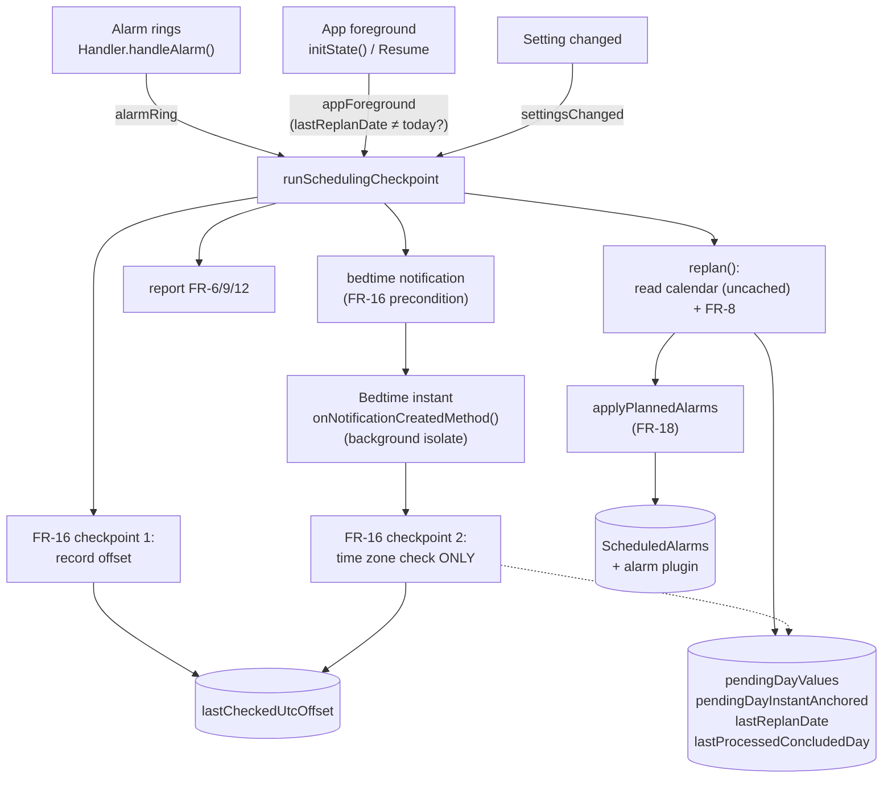

# Scheduling Logic v2: Requirements, Architecture, Implementation

> Status: designed, simulated multiple times, and checked for feasibility against the actual
> code/real dependencies (Android, Flutter, `device_calendar`, `awesome_notifications`, `alarm`,
> `timezone`). **Phases 0–5 implemented and subsequently consolidated (2026-09).**
> 21 functional requirements (FR-1–21), each with an exact formula/exact procedure and at least
> one fully worked test case. Fully replaces `lib/models/scheduling/scheduling.dart`'s
> `getEarliestEvent`/`adjustAlarmTimes`/`getStartTimeForDate`, not just in part.
> In keeping with the project-wide TDD principle (`CLAUDE.md`, "Development process"), each FR
> has at least one `test()` block, written before the corresponding rule.
>
> **What the TDD cycle itself brought to light** (the FR text below is corrected accordingly, see
> FR-4, FR-5, FR-6, FR-7, FR-9): several real logic errors that a purely textual spec review had not
> found. Phase 4 added two FR-3 fields that had been missed in Phase 0 (`preferredWakeUpTime`,
> `maxDailyDelta`; `lastEffectiveWakeTime` deliberately remains not a field of its own, but is
> derived from `pendingDayValues`).
>
> **Consolidation pass 2026-09-10** (findings from a consistency review of the whole rebuild,
> `docs/TODO.md` T-75 through T-88; all fixed in the code):
>
> - **T-61 is closed.** The earlier assessment "core fixed" had been wrong -
>   `hardFloor` passed `Meeting.from` on as a `TZDateTime` in the *appointment's own* zone, while
>   every other value is UTC-tagged and `_wallClockDelta` compares digit fields. Normalized at four
>   frame boundaries; the assumption "only applies to devices on UTC+0" no longer holds. So this
>   doesn't regress, the two permitted readings of a stored value now carry names
>   (`lib/models/scheduling/stored_values.dart`, T-83).
> - **T-76:** day arithmetic runs entirely over calendar fields
>   (`lib/models/scheduling/day_marker.dart`), not over absolute durations - otherwise
>   `computeWeekPlan` counted one window day too few across a daylight-saving transition.
> - **T-75:** FR-17's daily lock and the day-advance's progress are separate fields
>   (`lastReplanDate` and `lastProcessedConcludedDay` respectively) - previously a recovery replan
>   consumed the marker without advancing, and the day was lost for FR-9/FR-12.
> - **T-77/T-80/T-87:** there is exactly **one** entry point,
>   `runSchedulingCheckpoint({trigger})` (`lib/models/scheduling/checkpoint.dart`). It is serialized
>   against itself (previously the ring and resume triggers could run interleaved) and runs the
>   full sequence, including the bedtime notification.
> - **T-78:** FR-9's safety valve does not fire when `preferredWakeUpTime` is set (see FR-9) -
>   previously it was a one-way street into a permanently dead alarm for such users.
> - **T-79/T-81/T-82/T-84/T-88:** plugin initialization is awaited, FR-9 reports once per episode,
>   `pendingDayValues` is bounded from below, and tone/volume/gentle-wake are part of the FR-18
>   reconciliation (previously every planned alarm rang with the 0.6 default).
>
> **Still open:** `docs/TODO.md` T-62 (whether `onNotificationCreatedMethod` is actually triggered
> by a silent notification is not yet confirmed on a real or emulated device - "recommended" per
> spec, not a TDD blocker) and Phase 6 (retiring the old `Scheduler`, `docs/TODO.md` T-64/T-86).

## Scope

Applies exclusively to calendar-derived alarms (`ScheduledAlarm`). `ManualAlarm`s are entirely
excluded: this logic neither reads nor writes them, nor does it influence their state (**FR-15**).

## Basic concepts

**Time values** are treated throughout as absolute instants (date + time as a concrete instant,
e.g. UTC-based), never as bare time-of-day digits without a date (**FR-1**). Without this
convention, "earlier"/"later" and time differences are undefined across any midnight day boundary
and any time zone change. FR-1 only fixes the arithmetic; when a time zone change itself is
detected and how wall-clock-anchored values are handled then is governed by FR-16.

---

## FR-1 — Absolute instants, not time-of-day digits

Every time value used (`hardFloor`, `lastEffectiveWakeTime`, segment anchors, intermediate values)
is an absolute instant (date+time, internally comparable e.g. via a UTC representation).
"Earlier"/"later" and `ΔT` (time difference) are computed exclusively via the absolute difference
between two such instants.

- **Test:** anchor 22:00, `hardFloor` the next day at 05:00 → `ΔT = 7h, direction "later"`, not
  `ΔT = 17h, direction "earlier"` (a pure digit comparison with no day change).
- **Test:** anchor 07:00 before a time zone change (CET), `hardFloor` afterwards 07:00 in the new
  zone (JST, +8h offset) → `ΔT = 8h` (the instants differ by 8h), not `ΔT = 0`.

## FR-2 — `hardFloor(day)`: definition and meaning as an upper bound

Only defined for days with at least one real, **non-all-day** calendar appointment. A day with
only all-day appointments (`isAllDay=true`) or with no appointment at all is a **gap day** with no
`hardFloor`.

```
hardFloor(day) = earliest non-all-day appointment on this day
                 − durationToWakeUp − durationToGetReady
```

`hardFloor` is an **upper bound** ("no later than"). The planned value may be earlier (always
allowed), but **never later** (a later value means missing a real appointment).

**The appointment's own time zone:** the **appointment's own zone** exclusively determines the
conversion of its start into an absolute instant (already existing functionality,
`convertToTZDateTime` in `lib/utils/utils.dart`). The **device's time zone at the moment of
evaluation** (the same offset FR-16 checks) - **never** the appointment's own zone - decides which
calendar day the instant is assigned to. Rationale: whoever needs to be woken up is physically
wherever the device is, not wherever the appointment is located.

**Testability:** the pure function (`eventsForDay`) takes the device offset as an **explicit
parameter**, rather than calling `DateTime.toLocal()` internally - the latter would depend on the
executing machine's system time zone and would therefore not be deterministically testable. Only
the thin AppState layer (architecture) reads the actual, current offset (`DateTime.now()
.timeZoneOffset`) and passes it on as a value.

- **Test:** two non-all-day appointments (09:00, 07:00), `durationToWakeUp=15min`,
  `durationToGetReady=15min` → `hardFloor` = 07:00 − 30min = **06:30** (the earlier one counts).
- **Test:** one all-day + one non-all-day appointment (08:00), same offsets → `hardFloor` =
  08:00 − 30min = **07:30** (the all-day one never enters).
- **Test:** only an all-day appointment → no `hardFloor`, gap day.
- **Test (appointment's own time zone):** Tom (device on `Europe/Berlin`) has an appointment with
  `startTimeZone=Asia/Tokyo`, starting 03:00 JST = 19:00 CET **the day before** → counts toward
  `hardFloor` for the Berlin day before, not the Tokyo date.

## FR-3 — State

| Field | Type | Note |
|---|---|---|
| `maxDailyDelta` | `Duration` | `> 0`; a system minimum of **15 minutes** is enforced (at 0 the parameter would have no effect left on `hardFloor` segments - it would only apply where it's least needed) |
| `preferredWakeUpTime` | `TimeOfDay?` | a bare time of day, **not** an instant, **not** a date/zone - is only combined with a day + the current zone at the point of use (FR-4/FR-16); that's why FR-16 doesn't "carry over" anything onto `preferredWakeUpTime` itself on a time zone change |
| `lastCheckedUtcOffset` | `Duration` | the offset at the last FR-16 checkpoint |
| `gapDayCounter` | `int` | rolling safety-valve counter (FR-9) |
| `lastReplanDate` | `Date?` | **only** FR-17's daily lock: "has a checkpoint already run today?". **Not** updated by FR-16 checkpoint 2 |
| `lastProcessedConcludedDay` | `Date?` | the day-advance's progress: up to which *concluded* day have FR-9 and FR-12 counted/checked? Separate from `lastReplanDate` (`docs/TODO.md` T-75), because the two meanings diverge as soon as a checkpoint runs for a day not yet concluded today |
| `pendingDayValues` | `Map<Date, Instant?>` | the planned values themselves; `null` = no alarm for this day (a gap day without `preferredWakeUpTime`, or FR-9's valve). Revisable for any day not yet triggered (FR-11), fixed forever after that. Bounded from below at "from the day before yesterday" (T-82) |
| `pendingDayInstantAnchored` | `Map<Date, bool>` | per planned day: did the value come directly from a real `hardFloor` (instant-anchored), or from `preferredWakeUpTime`/the curve (wall-clock-anchored)? FR-16 checkpoint 2 has no calendar access and cannot re-derive this |
| `disabledDays` | `Set<Date>` | FR-21: days for which the user has explicitly **switched off** the planned alarm. Separate from `pendingDayValues`, because `null` there means "nothing planned" (FR-9/FR-10) and would be overwritten by the next planning run - the user's veto must not be |
| `snoozeEnabled` | `bool` | FR-20: is the user allowed to postpone the alarm? Default **true** (2026-09-25, maintainer request - was **false**) |
| `snoozeTime` | `Duration` | FR-20: by how much pressing snooze postpones. Default **5 minutes** |
| `snoozeOriginOf` | `Map<int, Instant>` | FR-20: per ringing alarm, the **original** wake instant. Carries the remaining budget across app restarts and across multiple snoozes - without it, a process death would restore the full budget |
| `overrunNotificationSent` | `bool` | FR-6 requires "once" - a marker for the current overrun episode |
| `safetyValveNotificationSent` | `bool` | the same for FR-9 (`docs/TODO.md` T-81) |

Refers exclusively to the `ScheduledAlarm` chain.

`lastEffectiveWakeTime` is deliberately **not** its own field: it is always the entry in
`pendingDayValues` for the most recently concluded day, and as a second source could only drift
apart from it.

## FR-4 — Days with no requirement of their own

A day with no `hardFloor` of its own, that does not fall within an active smoothing segment (FR-7
determines when a segment begins):

- Without `preferredWakeUpTime`: the value holds at `lastEffectiveWakeTime`'s time of day, but on
  the **real, actually planned calendar day** (`lastEffectiveWakeTime`'s date + 1), not on
  `lastEffectiveWakeTime`'s own date - otherwise the stored value carries yesterday's date even
  though it applies to today (found as a genuine bug during the TDD cycle itself: an initial
  version left the date unchanged).
- With `preferredWakeUpTime`: the value drifts toward `preferredWakeUpTime` (combined with the
  actual calendar day mentioned above, not with `lastEffectiveWakeTime`'s own -
  `preferredWakeUpTime` itself carries no date anyway, FR-3), bounded by `maxDailyDelta`/day,
  stops once reached (no overshoot) - **additionally capped by FR-7's backward check**, if a future
  real `hardFloor` exists within the window: the drift must never consume more reserve than is
  still needed to reach it in time. The distance to `preferredWakeUpTime` is compared here, as in
  FR-6, exclusively via the time-of-day components (see FR-6's clarification), not via the full
  calendar difference.

The following tests check the drift rule itself **in isolation**, without FR-7's cap (assuming no
future `hardFloor`) - the interplay with the cap is already tested by FR-7's own test cases.

- **Test:** `V=07:00`, `preferredWakeUpTime=null` → unchanged **07:00**.
- **Test:** `V=07:00`, `preferredWakeUpTime=09:00`, `maxDailyDelta=30min` → distance 2:00 > 30min → **07:30**.
- **Test:** `V=07:00`, `preferredWakeUpTime=05:00`, `maxDailyDelta=30min` → distance 2:00 > 30min → **06:30**.
- **Test (no overshoot):** `V=07:00`, `preferredWakeUpTime=07:15`, `maxDailyDelta=30min` → distance
  15min < 30min → **exactly 07:15**, not 07:30.
- **Test (goal reached):** `V=07:00`, `preferredWakeUpTime=07:00` → unchanged **07:00**.

## FR-5 — Grouping real `hardFloor` points into segments ("runs")

Real `hardFloor` points within the window: `t1, t2, …, tn`, chronological. Starting from the
current anchor `A` (day 0):

**Precondition: only a binding point can be a target.** Only a point whose time of day lies
**earlier** than `A` (ΔT per FR-6's clarification, i.e. purely via the time-of-day components)
qualifies as a target `t_m`. A point that is equal to or later than `A` demands nothing: someone
who gets up at 06:45 has long since satisfied an appointment at 11:00. FR-4 applies to such a day
(drift toward `preferredWakeUpTime`, bounded by `maxDailyDelta`), and the `hardFloor` then acts
only as a **cap** (FR-2's upper bound), never as a pull.

This follows directly from FR-2 ("the planned value may be earlier - **always allowed**") and from
step 1's own sentence ("`hardFloor` is exclusively an upper bound, never a directional
requirement"), but until 2026-09-11 was nowhere codified as a procedural rule - with the result
that every point became a target, even a later one. On a real calendar this made the wake time run
from 06:45 through 08:00 to 11:00, with `maxDailyDelta` = 30 min and `preferredWakeUpTime` = 07:00
(`docs/TODO.md` T-132).

Important distinction: this does **not** remove the points from the list. They still take part in
step 1's violation check - exactly what step 1's paragraph about the discarded "directional filter"
warns against. They are excluded only as a *target*.

- **Test:** `A=06:45`, `t1(day 1)=08:00`, `t2(day 2)=11:00`, `preferredWakeUpTime=07:00`,
  `maxDailyDelta=30min` → every day **07:00** (FR-4 reaches `preferredWakeUpTime` on the first day
  and holds), **no** overrun notification. Not 08:00/11:00.
- **Test:** same anchor, a single appointment at `05:00` in four days → run toward earlier:
  `06:18 / 05:52 / 05:26 / 05:00`, then drifts back toward `preferredWakeUpTime`.

1. Determine the point `t_m` (m ≥ 1) furthest in the future such that the even distribution
   `A→t_m` (FR-6) shifts **no** intermediate point `t1…t_{m-1}` past its own `hardFloor`. If this is
   violated for the next possible `t_m`, `m` is reduced until it holds (worst case `m=1`). **No**
   additional check of whether `t1…t_m` all "point in the same direction as `A`": an initial version
   contained such a directional filter, which proved wrong when working through a multi-day run -
   once `A` (the *current*, already advanced value, not the original run start, see FR-7) has
   already drifted past an intermediate point's `hardFloor`, that point can lie "on the wrong side"
   of `A` without actually being violated - a directional filter would have wrongly excluded it.
   `hardFloor` is exclusively an upper bound (FR-2), never a directional requirement - the violation
   check alone suffices.
2. A point with `ΔT=0` relative to `A` ends the run immediately at itself - it never counts as
   compatible with either direction, and is never grouped with a following point.
3. `A→t_m` is distributed per FR-6. `t_m`'s day becomes the new anchor for the next run, starting at
   `t_{m+1}`. Back to step 1.
4. Once all real points have been processed, FR-4 applies to every day after that.

This procedure (step 1 in particular) has two callers: **real**, when a run actually begins; and
**hypothetical**, freshly every day, out of FR-7's backward check, using *today's* value as the
anchor - to determine which target FR-7 must use.

- **Test:** `A=08:00`, `t1(day2)=07:00`, `t2(day4)=06:00` - both earlier than `A`, distributing
  `A→t2` does not violate `t1` → `t_m=t2`, one run over both.
- **Test (shrinking):** `A=09:00`, `t1(Wed)=06:00` (strict), `t2(Fri)=08:00` (looser) - a naive
  distribution `A→t2` over 5 days would give Wednesday roughly 08:24, violating `t1`'s `hardFloor`
  (06:00) → `t_m` must shrink to `t1`: first segment `A→t1` alone, then a new run from `t1` toward
  `t2`.
- **Test (`ΔT=0`):** `A=07:00`, `t1(Tue)=07:00`, `t2(Fri)=09:00` → `t1` ends its own run right at
  itself; `t2` starts a completely new run with anchor=`t1`.

## FR-6 — Distribution within a run

For a run from anchor `A` (day 0) to target `F` (day `N`):

```
ΔT = |A − F|
day_i = A + sign × (ΔT / N) × i,   for i = 1..N
```

If `ΔT/N > maxDailyDelta`: the difference is **likewise distributed evenly** over all `N` days (no
jump on a single day, **except** for `N=1` - there a jump is mathematically unavoidable and is
**not** a violation of this rule: "no jump on a single day" only justifies the distribution logic
for `N>1`, it is not a standalone guarantee). On every excess over `maxDailyDelta` (`N=1` or
distributed) the user is notified **once**.

**Clarification of `ΔT` and `day_i`'s date (found as a genuine bug during implementation, not
already at design time):** `A` and `F`, as real calendar-derived `hardFloor` points, often carry
dates that are genuinely far apart (`F` can be days after `A`). `ΔT = |A − F|` here means
**exclusively the time-of-day components** of `A` and `F` (hour/minute/second), **never** their
full calendar difference - a naive `F − A` instant difference across several real days would yield
a nonsensical value dominated by the day count, instead of the actually intended small daily
time-of-day shift. The ambiguity in determining direction is resolved as in FR-1 (the variant with
`|Δ| ≤ 12h` wins). Symmetrically, each `day_i` gets its **own, real calendar date**, `A`'s date `+
i` - **never** `F`'s own (possibly far-off) date. `F`'s own date is nowhere needed for the
calculation itself, only to place `F` at the right position in the window.

**Implementation note (UTC preservation):** if, when constructing `day_i` (or generally a "same
time of day, new date" value), a local constructor is accidentally used instead of a UTC one, even
though `A` itself was UTC-based, a real instant mismatch results - visible only on machines whose
system time zone differs from UTC (also found as a genuine bug during implementation) - every such
construction must carry over `A`'s (or the relevant reference's) `isUtc` flag.

- **Test (earlier):** `A=08:00, F=04:30, N=5, maxDailyDelta=60min` → `ΔT=3:30, ΔT/N=42min` (< 60min,
  no overrun) → day1=07:18, day2=06:36, day3=05:54, day4=05:12, day5=04:30.
- **Test (later):** `A=06:00, F=09:00, N=3, maxDailyDelta=90min` → `ΔT=3:00, ΔT/N=60min` (no
  overrun) → day1=07:00, day2=08:00, day3=09:00.
- **Test (overrun, `N>1`):** `A=08:00, F=04:30, N=3, maxDailyDelta=60min` → `ΔT/N=70min > 60min` →
  day1=06:50, day2=05:40, day3=04:30, notification.
- **Test (overrun, `N=1`):** `A=08:00, F=02:00, N=1, maxDailyDelta=60min` → full 6h jump,
  notification - **not** a spec defect.

## FR-7 — When does a run actually begin? ("As late as necessary")

A run does **not** begin on a day fixed in advance; instead it is freshly derived at **every**
daily replan from a backward check - structurally like FR-5's shrinking, just checked against the
remaining distance instead of an intermediate point.

Let `(F, N_F)` be the result of FR-5's grouping procedure, applied **hypothetically** with today's
value `V` as the anchor (`F = t_m`, `N_F` = its day distance) - **not** simply "the next real
`hardFloor` point": FR-5 can choose a farther, stricter point if a nearer intermediate one is
looser. For today's day `i` (`i=1` on the first day after the anchor):

```
N_remaining = N_F − i     (days from tomorrow to F, F included)
```

**Implementation note (found as a genuine bug, not already at design time):** `N_F` here is
necessarily **relative to `V`** (the real calendar-day distance from `V` to `F`) - the same number
that `groupTarget`/`distribute` also need for their own date placement (FR-5/FR-6). `i` is
implicitly always `1` on every call to `planGapOrRunStartDay` (the function always decides only the
one day immediately after `V`, never one further out) - so `N_remaining` is **always** `N_F − 1`,
never `N_F` itself. An initial implementation confused `N_F` (relative to V) directly with
`N_remaining` (without the `−1`) - isolated test cases with only a single `hardFloor` point did not
reveal this (a compensating error in the test data itself); only a full, multi-day test case worked
through via `computeWeekPlan` made the discrepancy visible.

The check applies **uniformly for every `N_remaining ≥ 1`** (`remainingPoints` by definition
contains only points genuinely before today, so `N_remaining ≥ 1` always holds) - **no** separate
`N_remaining ≤ 1` exception that passes straight through to FR-4: an initial version contained such
an exception, which proved wrong when working through a multi-day run - it would have wrongly
aborted an already-running, still-valid run on the second-to-last day and reset it to plain
`preferredWakeUpTime` drift. FR-6's own `N=1` exception (a single-day jump is not a spec defect) is
unaffected by this and applies as normal as soon as FR-6 itself is called with `N=1`.

- Check `|today's value − F| / N_remaining ≤ maxDailyDelta` for the intended value (holding, or a
  full `preferredWakeUpTime` step) - here too FR-6's clarification applies: the difference is
  time-of-day-based, not calendar-based:
  - **Satisfied:** today stays a gap day, FR-4 applies unchanged.
  - **Already violated by holding:** today is **day 1 of the run** - FR-6 applied directly, with
    `N = N_F − i + 1` (not `N_remaining` - that deliberately reserves one day of buffer, so that a
    single `preferredWakeUpTime` step doesn't unnoticed eat exactly the reserve the day after next
    still needs).
  - **Only the full `preferredWakeUpTime` step violates it:** the drift is reduced to the largest
    amount that still satisfies the condition (0 in the extreme case).

If even holding immediately is not enough (`N_remaining` already violated), the run begins today
immediately, and FR-6's overrun rule applies. The procedure treats "`F` earlier" and "`F` later"
than `V` symmetrically - no separate policy for either direction.

- **Test (one `hardFloor` point):** `preferredWakeUpTime=10:00`, `A=07:00` (Sun), `F(Sat)=05:00`,
  `maxDailyDelta=30min`.
  - Monday (`i=1, N_F=6, N_remaining=5`): holding satisfies `24min≤30min`. Full drift → `07:30`
    satisfies `30min≤30min` (boundary) → **Monday=07:30**.
  - Tuesday (`i=2, N_remaining=4`): holding at 07:30 violates `37.5min>30min` → **day 1 of the
    run**, `N=5` (Tue–Sat): **Tue=07:00, Wed=06:30, Thu=06:00, Fri=05:30, Sat=05:00.**
- **Test (two `hardFloor` points, FR-5 target ≠ next point):** `A=07:00` (Sun), `t1(Fri)=06:00`
  (loose), `t2(Sat)=04:00` (strict), `maxDailyDelta=30min`, no `preferredWakeUpTime`.
  - FR-5 (hypothetical): `t_m=t2` (distributing `A→t2` over 6 days gives 04:30 on `t1`'s day, not
    later than `t1`'s 06:00) → `F=t2, N_F=6`.
  - Monday (`i=1, N_remaining=5`): holding at 07:00 already violates `36min>30min` (even though
    `t1` alone would falsely suggest 15min/day) → **immediately day 1 of the run**, `N=6`:
    **Mon=06:30, Tue=06:00, Wed=05:30, Thu=05:00, Fri=04:30, Sat=04:00.**

## FR-8 — No extended computation horizon

Only the visible 7-day window, no larger horizon. Replanning happens **daily**, triggered by the
alarm's **actual ringing** (`Handler.handleAlarm()`, triggered via the `Alarm.ringing` stream in
`lib/main.dart` - **always** fires), **not** its dismiss instant (`Handler.onAlarmHandled()` -
fires only on an in-app dismiss, not on the native swipe path, not on an overlay-mount timeout; the
current v1 replan hangs on that, unreliably). The same ring instant also forms FR-16's first
checkpoint. A `hardFloor` outside the window only takes effect once it slides into the window via
the daily shift - even if by then there may no longer be enough lead time for FR-7, and FR-6 kicks
in immediately.

## FR-9 — Safety valve (rolling counter, not window-relative)

```
counter(today) = number of immediately consecutive, already concluded days
                 immediately before today with no real hardFloor,
                 reset to 0 on the most recently concluded day with a real hardFloor.
```

A purely window-relative counter would fire incorrectly on the day *before* a real appointment
that happens to lie just outside the window (the window on that day happens to be empty, even
though a legitimate run should already be running) - hence it's persistent and rolling, not a
window snapshot. Today itself does **not** count (not yet concluded) - "today" here means the day
for which the new window is currently being planned (the first day *after* the day whose alarm has
just rung); the latter day is itself already concluded at this point and enters the counter exactly
once, in exactly this checkpoint - not added retroactively later. Self-healing: no state that needs
manual resetting other than this one number. Once the counter reaches ≥7, automatic advancement is
stopped and the user is notified.

**Exception: `preferredWakeUpTime` set (added later, `docs/TODO.md` T-78).** The valve only fires
if *no* `preferredWakeUpTime` is set. Rationale: the valve is a fallback against *blind*
advancement - against drifting onward with no orientation at all. A set `preferredWakeUpTime`
**is** that orientation: FR-4 drifts toward it and stops exactly there, so the advancement is
inherently bounded and cannot run away. Without this exception, the valve would be a one-way street
into a permanently dead alarm for a user with a `preferredWakeUpTime` and no calendar appointments:
every window value becomes `null`, FR-18 then removes every future alarm, nothing rings anymore -
and with that there is no more ring checkpoint through which the counter could ever be reset (only
a day with a real `hardFloor` resets it). For an app that promises "guaranteed wake-up", that is
the wrong outcome.

The counter itself keeps running unchanged and keeps honestly counting appointment-free days - if
the user later removes their `preferredWakeUpTime` again, the valve fires immediately from the next
checkpoint on, without having to collect seven days afresh.

- **Test:** counter ≥7, no `hardFloor` in the window, but `preferredWakeUpTime` set → **no** firing,
  every window day keeps a value.
- **Test:** same case without `preferredWakeUpTime` → fires as before.

**Accepted residual risk:** within a running `_MyHomePageState` instance, `Alarm.ringing`
guarantees exactly one `handleAlarm()` per newly ringing alarm (already correctly deduplicated
against `_previousRingingAlarms`, `lib/main.dart`). Only if the app process is terminated and
restarted exactly while an alarm is actively ringing could the counter be incremented twice on that
one occasion - accepted, no special handling (the safety valve is a conservative fallback, not a
correctness-critical mechanism).

- **Test:** an appointment lies exactly 8 days in the future (outside the window); the 6 days
  immediately before today were appointment-free (today doesn't count) → counter stands at 6, not 7
  → no firing.

## FR-10 — Cold start

If no `lastEffectiveWakeTime` exists (the very first planning run), **no** value is invented for
days before the first real `hardFloor`:

- With `preferredWakeUpTime`: these days use it.
- Without: no alarm planned.
- The first real `hardFloor` is set on its own day (FR-2) and becomes the anchor for all following
  days from then on.

- **Test:** days 1–5 appointment-free, day 6 `hardFloor=05:30`, no `preferredWakeUpTime` → days 1–5
  no alarm, day 6=05:30 becomes the new anchor.

## FR-11 — Revisability up to the actual ring

A value already computed for a day, but not yet triggered, stays revisable: if the **next actual
calendar re-read** yields a changed calendar picture, the value may be adjusted retroactively
(including reapplying FR-5–FR-7). Only the value that has actually been triggered is fixed forever.

**No live detection:** `device_calendar` (`^4.3.2`) offers no change notification (no
stream/callback, no `ContentObserver`, neither on the Dart nor the native side) - the actual
re-read instants are FR-8's ring checkpoint and FR-17's app-foreground checkpoint, whichever comes
first. A live mechanism would be technically buildable (Android `JobInfo.addTriggerContentUri`),
but disproportionate for a private alarm app, and would be batched/delayed by the OS anyway.

**Uncached access is mandatory:** the re-read must query the calendar **fresh** - the existing
`updateCalendarData`/`_fetchedCalendarWeeks` caching (`lib/app_state.dart`) permanently marks weeks
as "loaded", even if never re-queried (`docs/TODO.md` T-60 - already a bug in the existing code,
independent of v2). The new planning must **not** reuse this cache, or a calendar change would stay
invisible for the entire process lifetime.

## FR-12 — Appointments discovered late, after the alarm rang

If, at the **next actual calendar re-read** (FR-8 or FR-17, whichever comes first) after a day's
alarm has rung (no longer revisable per FR-11), a real appointment becomes known through
late-arriving calendar data whose `hardFloor` would have lain before the ring instant: the rung
value stays unchanged, but the user is informed, **at exactly this re-read instant**, with a
dedicated "possibly missed appointment" notification - distinguishable from FR-6's and FR-9's
notifications. For lack of live detection (FR-11), the next re-read is the earliest instant
actually reachable - not immediate in the literal sense.

## FR-13 — `getStartTimeForDate` with several appointments

Unchanged: if a day has several non-all-day appointments, only the earliest counts toward
`hardFloor`.

## FR-14 — `durationToWakeUp`/`durationToGetReady`

Unchanged, already decided before this document: `durationToWakeUp` is only counted under the
assumption of an existing snooze mechanism (`docs/TODO.md` T-18, unimplemented) - the exact
calculation itself is not the subject of this specification.

## FR-15 — `ManualAlarm` isolation

This entire logic exclusively reads, writes, and influences the `ScheduledAlarm` chain.
`ManualAlarm`s are never used as a `hardFloor` source, never changed by segment
formation/distribution, and `lastEffectiveWakeTime` is never set or read from a `ManualAlarm`
value.

- **Test:** a `ManualAlarm` at 03:00 on a day whose `ScheduledAlarm` curve would regularly give
  07:00: the planned value stays exactly 07:00, unaffected.

## FR-16 — Time zone change: two daily checkpoints

The currently effective **UTC offset** is freshly read at exactly two points per day (via
`DateTime.now().timeZoneOffset`, platform-side - **not** via the existing `Location`/abbreviation
table in `lib/main.dart`/`getLocationFromAbbreviation()`, which guesses ambiguously from a POSIX
abbreviation like `"CST"` among three real zones, and stays correctly used for its actual purpose -
FR-2's appointment-own-time-zone conversion - but would be needlessly error-prone for a pure offset
comparison), and compared with the offset at the previous checkpoint:

1. **At the actual ring** (`Handler.handleAlarm()`, see FR-8).
2. **At the computed bedtime instant** = `next planned wake instant − sleepGoal −
   reminderDuration` (`sleepGoal`/`reminderDuration`: existing app state,
   `lib/screens/sleep_habits/screen_sleephabits.dart`) - **regardless of** whether the bedtime
   notification itself is enabled. Triggers **only** the time zone comparison, **no** replanning,
   **no** calendar access.

No third, continuous background timer - both checkpoints hang off events that are scheduled
anyway. FR-17 adds a conditional third trigger for checkpoint 1 (app foreground), not a standalone
third FR-16 checkpoint.

**Why two points in time:** a single daily check would only notice a time zone change that
happens during the day (e.g. Tom's flight lands in the afternoon) at the next ring.

**Behaviour on a detected change** (the offset is compared, not the zone name - this recognizes a
genuine location change and a plain daylight-saving change the same way):
- **Instant-based values** (`hardFloor`): unchanged (FR-1) - only the local display changes.
- **Wall-clock-anchored values** (`preferredWakeUpTime`, carried-forward intermediate values): are
  **carried over into the new zone with the same digits** (alarm-clock convention: "7:00" stays
  "7:00", now in the new zone), no full recomputation of the segments/runs - that only follows at
  the next regular planning run.

**Precondition (built):** checkpoint 2 had no hook in the original code - scheduled notifications
(`awesome_notifications`) do not run any Dart code when they fire unless a listener is registered,
and with the reminder disabled, nothing at all gets scheduled on the device today. Solution
(verified against the package source, high confidence): a `NotificationContent` **without**
`title`/`body` creates a "background notification" (never visible), which triggers
`onNotificationCreatedMethod` (**not** `onNotificationDisplayedMethod` - that only fires when
something actually appears in the status bar). This callback runs in its own background isolate
**without** `AppState`/`Provider` access - `pendingDayValues`/`lastCheckedUtcOffset` must be
read/written directly via `SharedPreferences`. **Newly found caveat:** if the app has been fully
terminated (force-quit), notification events are, per the package docs, only caught up at the next
foreground/background start, not at the scheduled instant - see FR-17.

**Clarification (`docs/TODO.md` T-85d):** the registered listener fires for **every** notification
created, not just the bedtime notification - also for the FR-6/FR-9/FR-12 warnings and (in debug
builds) for Handler's diagnostic notifications. Checkpoint 2 thus effectively fires more than once
daily. This is harmless and even beneficial (the offset comparison is cheap, idempotent, and thus
catches a change earlier), but it shifts the comparison baseline: "the offset at the last
checkpoint" means "at the last *arbitrary* notification event". Deliberately left this way, rather
than filtering on `sleepReminderNotificationId` - FR-16's goal is to notice a change happening
during the day early, and more opportunities serve exactly that.

**Known limitation on the transition day itself (`docs/TODO.md` T-85e):** a wall-clock-anchored
value for the transition day is computed the day before with the *old* offset, and checkpoint 2
runs at bedtime - so still before the change happens overnight. On that one day such an alarm
therefore rings off by the offset difference; it is corrected at the ring checkpoint that same
morning (which replans) or at the latest the following day. Instant-anchored values (real
appointments) are unaffected. Accepted: a fix would need to look ahead at the next day's zone
rules, which is exactly what FR-16's model ("compare offsets, don't interpret zone names")
deliberately does not do.

- **Test (location change):** alarm rings at 06:00 (zone A, +1). At 14:00 Tom lands in zone B (+9).
  The bedtime checkpoint detects the changed offset; `preferredWakeUpTime` (e.g. 09:00) now applies
  as 09:00 in zone B. Without the second checkpoint this would only have been corrected at the next
  ring (>12h later).
- **Test (daylight saving):** the zone stays "Europe/Berlin", clocks move overnight from CET (+1) to
  CEST (+2) → the next checkpoint detects the changed offset identically to a location change, no
  separate case distinction needed.

## FR-17 — App foreground as a catch-up checkpoint

```
If lastReplanDate ≠ today's calendar date (device time zone):
    immediately, before any UI interaction, the same sequence as FR-8's ring checkpoint
    (time zone check + full replan, uncached calendar access).
Otherwise: no additional checkpoint.
```

Catches three independent gaps with the same, already existing mechanism: **reboot** (the native
alarm re-registration runs without the Flutter engine, so FR-8/FR-16 don't run along with it),
**force-quit** (notification events are only caught up at the next foreground/background start,
FR-16), and **FR-11/FR-12 "only once daily"** (for lack of live calendar detection, the ring
checkpoint would otherwise be the only re-read - opening the app in between is an additional,
cheap opportunistic re-read).

- **Test:** `lastReplanDate` points to a day before today (e.g. after a 2-day reboot) → app start
  triggers exactly one additional full checkpoint, `lastReplanDate` is set to today.
- **Test:** `lastReplanDate` already points to today → no additional checkpoint.
- **Test (regression):** a second app start right after the first (e.g. a quick restart) → does not
  fire again, since `lastReplanDate` was already updated - no duplicate replan on the same day.

## FR-18 — Applying it: planned values become real alarms

**Added later** (`docs/TODO.md` T-63): FR-1–FR-17 describe only *computation* and *triggers*. The
step that actually translates the computed daily values into alarms was entirely missing from this
specification - with the result that the finished implementation had no functional effect (it
wrote `pendingDayValues`, which nobody read; every alarm that actually rang still came from the old
`Scheduler`).

After **every** replan (FR-8, i.e. from within the same call - not as a separately invocable step,
or it can be forgotten again), the set of `ScheduledAlarm`s is reconciled to match exactly the
planned values:

- For every planned value **after now** with no matching alarm, exactly one is created (a
  minute-precise comparison - the alarm plugin call only knows minutes anyway).
- A `ScheduledAlarm` **in the future** that matches no planned value (a revised day, a day with no
  alarm per FR-9/FR-10) is removed.
- A `ScheduledAlarm` **in the past** is **never** removed: the application also runs from within
  FR-8's ring checkpoint, i.e. *while* an alarm is ringing - and its time is then in the past. To
  remove it as "no longer planned" would silence it mid-ring via `Alarm.stop()` and defeat the
  guaranteed wake-up. Cleaning up genuinely stale alarms remains `Handler.handleAlarm`'s own job
  (`isAlarmStale`).
- Already-past planned values are not re-set (FR-11: the triggered value is fixed).
- `ManualAlarm`s are never read or written in the process (FR-15).

- **Test:** a planned future value with no existing alarm → exactly one `ScheduledAlarm` is
  created.
- **Test:** a matching alarm already exists → no duplicate, no removal (idempotent).
- **Test:** an existing future alarm with no planned counterpart → removed.
- **Test:** a `null` day value → no alarm, an existing one is removed.
- **Test (safety-critical):** an existing alarm 5 minutes in the past (possibly ringing right now)
  → is **not** removed.

---

## Architecture

```
Platform entry points (existing code, adapted)
 lib/models/alarms/handler.dart   Handler.handleAlarm()          -> alarmRing
 lib/main.dart                    initState() / didChangeApp…    -> appForeground
 lib/screens/sleep_habits/…       every planning-relevant        -> settingsChanged
 lib/screens/settings/page_…      setting (tone, volume)
 lib/utils/notifications.dart     onNotificationCreatedMethod()  -> checkpoint 2 only
        │ calls
THE entry point (lib/models/scheduling/checkpoint.dart)
 runSchedulingCheckpoint(AppState, {trigger})   serialized (T-77), complete
 runCheckpointSafely(...)                       the same, errors swallowed
   Sequence: lock -> FR-17 daily lock -> record offset (FR-16) ->
            replan() -> report FR-6/9/12 -> bedtime notification (T-80)
        │ calls
AppState-aware orchestration (lib/models/scheduling/replan.dart)
 replan(AppState)                 reads the calendar uncached (T-60), calls FR-8,
                                  day-advance (FR-9/FR-12), applies FR-18
 runTimezoneCheckpoint2(...)      FR-16 checkpoint 2 - reads/writes
                                  SharedPreferences directly (background isolate)
        │ calls
Pure domain logic (lib/models/scheduling/scheduling_v2.dart)
 hardFloor, eventsForDay (FR-2) · distribute (FR-6) · groupTarget (FR-5)
 applyGapDayDrift (FR-4) · planGapOrRunStartDay (FR-7) · computeWeekPlan (FR-8)
 coldStart (FR-10) · updateGapDayCounter (FR-9) · reinterpretForNewOffset (FR-16)
 - ONLY plain values (Instant/Duration/TimeOfDay/Map), no AppState, no
   BuildContext, no plugin access - directly unit-testable without mocks

Application and helper modules
 apply_alarms.dart      planAlarmSync (FR-18, pure) + applyPlannedAlarms
 replan_notifications.dart  FR-6/FR-9/FR-12 as notifications (once per episode each)
 next_wake_up.dart      nextWakeUpTime (plan + ManualAlarms, for bedtime)
 day_marker.dart        calendar day arithmetic (T-76): midnight/dayMarker/
                        dayDistance/dayStamp/isoDate
 stored_values.dart     the two permitted readings of a stored value (T-83):
                        instantFromStored (domain, UTC) / localFromStored (UI)
 lib/utils/sleep_reminder.dart  scheduleSleepReminder (FR-16 "precondition")
```



No dedicated trigger exists for calendar changes themselves (FR-11) - a changed appointment takes
effect at the next checkpoint. All nine new `AppState` fields (FR-3) persist following an
already-proven pattern: `int`/`bool`/`String` directly via `setInt`/`setBool`/`setString`,
`pendingDayValues` and `pendingDayInstantAnchored` via `jsonEncode`/`jsonDecode` (like
`_scheduledAlarms` today) - no new persistence idea needed.

**What disappears:** `lib/models/scheduling/scheduling.dart`'s current `getEarliestEvent`,
`adjustAlarmTimes`, `getStartTimeForDate`, and the private `Scheduler` class. `docs/TODO.md` T-02
and T-32 become moot as a result.

## Implementation order

Every phase builds exclusively on already-completed phases. "∥" = order within the phase doesn't
matter. Per step: test(s) from the FR sections above first, then implementation
(red-green-refactor: one test case, minimal implementation, clean up, next test case -
`CLAUDE.md`, "Development process"). If a test uncovers a gap in the spec itself, the spec is
corrected first, then the test is adjusted.

**Phase 0 - Foundation:** (1) establish the `Instant`/`Duration`/`TimeOfDay` convention. (2∥) add
four new `AppState` fields (persistence round-trip test first).

**Phase 1 - Pure segment/distribution core:** (3∥) `distribute()` FR-6. (4∥) `applyGapDayDrift()`
FR-4. (5∥) `hardFloor()`+`eventsForDay()` FR-2. (6) `groupTarget()` FR-5 - needs 3. (7)
`planGapOrRunStartDay()` FR-7 - needs 3,4,6 (in particular the multi-target test case is the real
reason FR-5 must be done before FR-7).

**Phase 2 - Week-wide orchestration (pure):** (8∥) `updateGapDayCounter()` FR-9. (9)
`coldStart()` FR-10 - needs 5. (10) `computeWeekPlan()` FR-8 - needs 5,7,8,9, the big integration
step. (11∥) FR-15 invariant as a regression test.

**Phase 3 - Time zone core (independent of Phase 1/2):** (12) `reinterpretForNewOffset()` FR-16 -
needs only Phase 0.

**Phase 4 - AppState orchestration + calendar fix:** (13) fix T-60 first (calendar cache bypass,
independent of the rest) - test: two `replan()` calls with different fake calendar data, the second
result must reflect the new data. (14) `replan(AppState)` - needs 10,13. (15) FR-11 behaviour -
needs 14. (16) FR-12 behaviour - needs 14/15. (17) `runAlarmRingCheckpoint()` - needs 12,14. (18)
`onAppForegroundCheckpoint()` FR-17 - needs 17.

**Phase 5 - Platform wiring:** (19) `Handler.handleAlarm()` → `runAlarmRingCheckpoint()` - needs 17
- test first: in particular the 3s overlay-timeout regression test (fails against unmodified code).
(20) `initState()` → `onAppForegroundCheckpoint()` - needs 18. (21∥) always schedule the bedtime
notification, regardless of `reminderEnabled` - test first (fails against unmodified code, since
`setSleepReminder()` today is only called when the reminder is enabled). (22) build
`onNotificationCreatedMethod` + wire up `setListeners` - needs 21,12 - **recommended beforehand**
(not a TDD blocker): a confirmation test on a real/emulated device that the silent notification
actually triggers the callback.

**Phase 6 - Cleanup:** (23) remove the old `Scheduler`/`_adjustAlarmTimes`/`getEarliestEvent`.
(24) mark `docs/TODO.md` T-02, T-32, T-60 as done. (25) extend `CLAUDE.md`'s testing status section
with the new test files.

**Phase 7 - Optional:** (26) extend `integration_test/app_test.dart` with a scenario for FR-17's
foreground checkpoint - reliability in CI not guaranteed, document as open rather than silently
treating it as tested.

Phases 1–3 carry the least risk (pure `flutter test`, no mocks, no devices) and deliver visible TDD
progress fastest - start there first.

## FR-20 — Snooze: postpone, never disable

**Principle.** Snooze **never disables the alarm**. It ends the current ring and re-arms the same
wake call `snoozeTime` later. A user who only ever presses snooze keeps being woken up until the
budget is exhausted - after that, only the regular switch-off remains.

**The budget is `durationToWakeUp`, and that is no coincidence.** FR-2 sets the wake instant to
`earliest appointment − durationToWakeUp − durationToGetReady`. The first duration is the time to
become properly awake, the second the time to get ready. Snooze may only consume the **first**:

```
Sum of all postponements of a wake call <= durationToWakeUp
```

From this follows the load-bearing guarantee, without needing to be checked separately: **someone
who only snoozes still gets out the door on time.** The getting-ready time stays untouched, the
appointment is not missed - and that is exactly why the budget is this duration and not some
separate number.

Concretely: another snooze is only offered if

```
now + snoozeTime <= original wake instant + durationToWakeUp
```

If this is not satisfied, the snooze button disappears. The alarm keeps ringing; the user has to
switch it off normally.

**Snooze never needs the QR code.** Even when a deactivation code is set and switching off requires
it (the "guaranteed wake-up"), snooze is reachable without a scan. Rationale: snooze disables
nothing - it only postpones, and within a budget that cannot endanger the appointment. Requiring
the code just to **keep being woken up** would be pointless, and would risk pushing the user to
switch the device off entirely.

**Defaults (2026-09-25, maintainer request).** `snoozeEnabled` = `true`; `snoozeTime` = 5 minutes;
`durationToWakeUp` = `00:15`. Previously `snoozeEnabled` = `false` and `durationToWakeUp` =
`00:00` - the bump mechanism below existed specifically for that combination and is unchanged, it
just no longer fires on a fresh install, since `durationToWakeUp` no longer starts at exactly
`00:00`. If `snoozeEnabled` is switched on while `durationToWakeUp` is `00:00` (e.g. a user who
manually drove it down to zero), it is set to **10 minutes** - otherwise the budget would be zero
and the feature just switched on would be dead from the start. An already-set value is left
untouched.

**Two interactions that are not obvious, and without which it breaks:**

1. **The postponed wake call must not fall into FR-18's hands.** FR-18 removes every
   `ScheduledAlarm` in the future with no planned counterpart - and a call postponed to `now +
   snoozeTime` has none. It is therefore **not** tracked as a `ScheduledAlarm`, but as a plain
   platform alarm with its own id, unknown to `AppState`. FR-18 only looks at
   `appState.scheduledAlarms`; a platform entry with no counterpart is left untouched (specifically
   checked, `docs/TODO.md` T-127).
2. **The postponed call does not trigger a ring checkpoint.** FR-8's checkpoint already ran at the
   first ring; the day is concluded. A second checkpoint would add nothing, but would touch FR-9's
   counter and FR-11's anchor again. Since the postponed call is unknown to `AppState`, `Handler`'s
   existing rule "only a ringing `ScheduledAlarm` drives the chain" (FR-15, `docs/TODO.md` T-73)
   applies on its own - no additional special rule is needed.

**Manual alarms** are included: snooze postpones them too, with the same budget. FR-15 is
preserved, because the postponed call never touches the `ScheduledAlarm` chain at all.

- **Test (budget):** `durationToWakeUp = 30min`, `snoozeTime = 5min`, wake call at 06:00.
  → snooze is possible up to and including the postponement to **06:30**; the press that would lead
  to 06:35 is no longer offered. Six postponements, then it stops.
- **Test (budget exhausted despite waiting):** same setup, the user lets it ring until 06:28 and
  then presses snooze → `06:28 + 5min = 06:33 > 06:30`, so **no** more snooze. The budget counts
  from the original wake instant, not from the last press.
- **Test (default):** `snoozeEnabled = false` → no snooze button, regardless of what the other
  values say.
- **Test (switching on):** `snoozeEnabled` from `false` to `true` with `durationToWakeUp = 00:00`
  → `durationToWakeUp` is then `00:10`. With `durationToWakeUp = 00:45` it stays `00:45`.
- **Test (QR):** deactivation code set → switching off requires the scan, snooze does **not**.
- **Test (no switch-off):** after a snooze the wake call is still armed; there is no state in
  which snooze has removed it.

## FR-21 — A switched-off alarm does not ring

**Principle.** When the user switches an alarm off with the toggle in the alarm list, it does not
ring — immediately, permanently, and across restarts. This holds for **both** kinds of alarm, the
planned ones this specification computes and the manual ones the user sets by hand.

This was **not** the case: `enabled` was stored, passed through constructors, compared and bound to
the UI toggle, but read nowhere when an alarm is armed or cancelled (`docs/TODO.md` T-03, a P0
blocker). The toggle looked like a promise and was none — for an alarm clock the worst kind of
defect, because the user relies on it and finds out only when it rings.

**Three assurances, for either kind of alarm:**

1. **Immediately.** Switching off cancels the platform alarm that is already armed, not just at the
   next checkpoint.
2. **Permanently.** Nothing arms it again behind the user's back.
3. **Across restarts.** The state is persisted.

### Planned alarms

Assurance 2 is where a naive fix fails here: FR-18 rebuilds the alarm set from `pendingDayValues`
on **every** re-plan, so a bare `Alarm.stop()` when the toggle is flipped would be undone at the
next ring checkpoint — and that one runs for certain, because another alarm is ringing.

**Why a separate field (`disabledDays`) and not `pendingDayValues[day] = null`:** there, `null`
means "nothing planned" (a gap day without a preferred wake-up time, or FR-9's valve), and the next
planning run overwrites the entry out of its own arithmetic. The user's veto would vanish with it.
It is a different statement from the plan, so it lives beside it, not inside it. FR-3's warning
about a "second source" is about the *derived* `lastEffectiveWakeTime`, not about a standalone user
decision.

**Boundaries:**

- The switched-off day stays in the plan and stays an **anchor** for the smoothing (FR-4/FR-6). The
  user said "do not wake me on this day", not "remove this day from my rhythm".
- FR-9's counter is untouched: a switched-off day is not an appointment-free day.
- Switching the day back on restores the planned value immediately.
- A switched-off day that has passed is cleaned up along with `pendingDayValues` (the same
  retention bound, T-82) — otherwise the set grows without limit.
- **Snooze (FR-20) is unaffected:** there is nothing to postpone that does not ring.

- **Test:** switch tomorrow's alarm off → `Alarm.getAlarms()` no longer contains it; a following
  checkpoint (ring, settings change, sync button) does **not** re-arm it; after an app restart it
  stays off.
- **Test:** the same day switched back on → the planned value is unchanged and armed again.
- **Test:** a switched-off day does **not** change the other days' wake times — it remains an anchor
  of the curve.

### Manual alarms

The same promise, and a **simpler mechanism**: a manual alarm is an object the user owns directly.
Nothing re-derives it, and FR-15 keeps the planner away from it altogether, so there is no analogue
to the `disabledDays` problem — the flag on the object *is* the durable statement, and the only
thing missing was that nobody ever acted on it.

What the toggle must do:

- **Off:** cancel the platform alarm carrying this alarm's id, and persist `enabled = false`.
- **On:** arm it again for the **next occurrence** of its `TimeOfDay` — today at that time if that
  is still ahead, otherwise tomorrow. This is the same resolution used when the alarm was created,
  so switching off and on again may not silently move the alarm to a different day than a freshly
  created one with the same time would get.
- Creating or editing an alarm that is switched off must **not** arm it. Otherwise the defect
  returns through the back door: the user edits the title of a switched-off alarm and it is live
  again.

**One consequence beyond the arming itself.** The bedtime reminder asks `nextWakeUpTime()` when the
user has to sleep. It reads manual alarms deliberately (see FR-15's note there), and it must now
**skip the switched-off ones** — a reminder computed from an alarm that will not ring sends the
user to bed for a wake-up that never comes. Until this requirement, that function documented its
ignoring of `enabled` as deliberate, precisely *because* the flag was known to be inert app-wide;
that reasoning ends here.

**Boundary:** `repeatOnDays` stays inert and is a separate matter (`docs/TODO.md` T-14). A
switched-off alarm stays in the list and keeps its time — switching off is not deleting.

- **Test:** switch a manual alarm off → the platform alarm with its id is stopped, no new one is
  armed, and `enabled` is `false` after reloading the persisted state.
- **Test:** switch it back on → it is armed for the next occurrence of its time; with the time
  already past today, that is tomorrow, not today.
- **Test:** a switched-off manual alarm does not feed the bedtime reminder — `nextWakeUpTime()`
  skips it and returns the next one that will actually ring.
- **Test (counter-check against over-correction):** a switched-on manual alarm is still armed, and
  still feeds the reminder, exactly as before.
